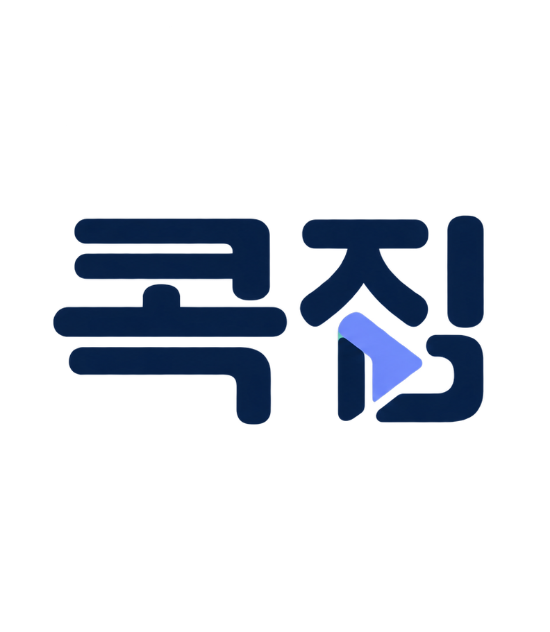

<div align="center">



### 강의에서 다시 볼 것만 콕.

콕집은 매일 쌓이는 강의를 처음부터 다시 볼 필요 없이, 지금 다시 봐야 할 내용만 골라 필요한 부분부터 효율적으로 복습할 수 있도록 도와주는 학습 서비스입니다.

<br />

[](https://kokjip-prd-to-srs-psi.vercel.app)
[](https://kokjip-prd-to-srs-psi.vercel.app/review)
[](https://kokjip-prd-to-srs-psi.vercel.app/instructor/seed-instructor-token)
[](https://kokjip-prd-to-srs-psi.vercel.app/institution/login)

[](docs/01-prd/prd.md)
[](docs/02-srs/srs.md)
[](docs/03-tds/tds.md)
[](tasks/task-list.md)
[](docs/00-plan/grip-register.md)

</div>

---

국비 지원 직업훈련 과정(KDT)의 수강생이 대상입니다. 강의를 녹음해 글로 옮기고, **강사가 실무 중요도나 면접 빈출을 직접 강조한 말**을 찾아내, 학습 자료의 **목차 항목을 우선 학습할 순으로** 보여줍니다.

중요도를 판단하는 주체는 기계가 아니라 강사입니다. 제품은 강사가 이미 입 밖으로 낸 말을 찾아 옮길 뿐이고, 목차도 강사가 만든 교재의 것을 그대로 씁니다.

> 이 저장소는 **착수 전 결정 29건에서 시작해 PRD · SRS · TDS · 태스크를 거쳐 동작하는 웹까지 이어 본 기록**입니다. 문서가 코드보다 먼저 있고, 코드의 모든 갈래가 어느 요구사항에서 왔는지 되짚을 수 있게 만들었습니다.

---

## 📍 어디부터 보면 되나요

**제품이 궁금하시다면**

| 보고 싶은 것 | 어디로 |
|---|---|
| 돌아가는 화면 | [데모](https://kokjip-prd-to-srs-psi.vercel.app) — 로그인 없이 학습자·강사 화면을 볼 수 있습니다 |
| 왜 만드는가 | [제품 요구사항 정의서](docs/01-prd/prd.md) |
| 무엇이 근거인가 | [아래 실측 표](#-근거가-되는-실측) · [원가 모형](docs/00-plan/cost-model.md) |

**만드는 과정이 궁금하시다면**

| 보고 싶은 것 | 어디로 |
|---|---|
| 착수 전에 무엇을 정했나 | [결정 기록부](docs/00-plan/grip-register.md) → [결정 29건의 근거](docs/00-plan/product-decisions.md) |
| 무엇을 만족해야 하나 | [시스템 요구사항 정의서](docs/02-srs/srs.md) — 요구사항 34건, 각 건에 근거와 수용 기준 |
| 어떻게 설계했나 | [기술 설계 문서](docs/03-tds/tds.md) — 표 20종, 계층, 판정 흐름 |
| 어떤 단위로 구현했나 | [태스크 목록](tasks/task-list.md) — 15개, 요구사항과 대조표 |
| 사람이 하는 일은 무엇인가 | [운영 문서](docs/04-ops/) — 대응 절차 · 강사 안내문 · 현장 인터뷰 설계 |

**코드가 궁금하시다면**

| 보고 싶은 것 | 어디로 |
|---|---|
| 업무 규칙이 모인 곳 | [`src/domain/`](src/domain/) — 정본 선정, 덮인 범위, 시각 환산, 뒤처짐 판정 |
| 데이터 모델 | [`prisma/schema.prisma`](prisma/schema.prisma) |
| 화면 | [`src/app/`](src/app/) |

---

## 🎯 무엇을 푸는가

### 학습자가 겪는 일

직업훈련 과정의 수강생은 하루 6시간에서 8시간을 강의로 보내고, 그날 저녁에 복습할 수 있는 시간은 한두 시간입니다. 배운 양과 복습할 수 있는 양의 차이가 매일 쌓입니다.

문제는 양이 많다는 것 자체가 아니라 **무엇을 버릴지 스스로 정할 수 없다**는 데 있습니다. 다른 분야에서 넘어온 수강생은 아직 지식의 뼈대가 없어서 무엇이 중요한지 가려낼 기준이 없습니다. 잘못 버렸을 때 무엇을 잃는지 알 수 없으니 아무것도 버리지 못하고, 결국 전부 훑다가 아무것도 남지 않습니다.

> **이미 있는 도구는 이 문제를 풀지 못합니다.** 녹음을 글로 옮겨 주는 도구와 요약해 주는 도구는 길이를 줄일 뿐, **이건 안 봐도 된다는 결정을 내리지 못합니다.** 잘못 버렸을 때 책임질 근거가 도구 안에 없기 때문입니다.

### 훈련기관이 겪는 일

복습을 따라가지 못한 수강생은 과제를 내지 못하고, 과제를 놓치기 시작한 수강생은 과정을 끝까지 마치지 못합니다. 훈련기관은 이 경로가 진행되는 동안 알아채지 못합니다. **출석은 하고 있으므로 출석부에는 아무 신호도 남지 않습니다.**

### 콕집이 내놓는 답

| 문제 | 콕집이 하는 일 |
|---|---|
| 무엇을 버릴지 정할 기준이 없다 | **강사가 강조한 말**을 근거로 삼습니다. 기준을 기계가 만들지 않습니다 |
| 요약은 길이만 줄인다 | 요약하지 않고 **교재 목차의 어느 항목을 먼저 볼지** 순서를 정합니다 |
| 왜 이게 중요한지 확인할 수 없다 | 각 항목에 **강사의 말을 원문 그대로** 붙여 몇 초 안에 걸러낼 수 있게 합니다 |
| 놓친 것을 찾을 길이 없다 | 목록과 별개로 **강의 기록 전체를 여는 길**을 항상 둡니다 |
| 기관이 위험 신호를 못 본다 | 복습 목록을 **사흘 연속 열지 않은 수강생**만 기관 화면에 올립니다 |

---

## 🧭 제품이 도는 순서

```text
강사 동의 → 학습 자료 올리기 → 목차 읽기 → 학습자 녹음 → 기기에서 전사
   → 회차가 다룬 목차 구간 정하기 → 강조한 말 찾아 항목에 붙이기
   → 목차 항목을 우선 학습할 순으로 → 그 지점부터 다시 듣기
```

학습자가 보는 결과는 이런 모양입니다.

```text
오늘 먼저 볼 순서

1. 3장 2절  요구사항 정의        근거 3건
2. 5장 1절  테스트 방식          근거 2건
3. 2장 4절  이해관계자 식별      근거 1건
```

항목을 열면 강사가 강조한 말이 나오고, 그 말을 누르면 녹음의 해당 지점부터 다시 들을 수 있습니다.

### 되돌리기 어려운 결정들

- **복습의 단위는 목차 항목입니다.** 강조한 말은 그 항목을 먼저 봐야 하는 근거로 항목 안에 들어갑니다.
- **음성은 기기를 떠나지 않습니다.** 서버는 글만 받습니다. 예외 경로만 음성을 잠시 거치며 처리 후 즉시 지웁니다.
- **학습 자료 원본도 남기지 않습니다.** 목차를 읽고 나면 즉시 지웁니다. 본문을 담는 열 자체가 없습니다.
- **회차당 정본 한 벌만 판정합니다.** 서른 명이 올려도 값은 한 벌만 듭니다.
- **발화 지점은 실제 시각으로 저장합니다.** 각자의 녹음에서 몇 분 몇 초인지는 화면에서 환산합니다.
- **강사가 동의해야 녹음 버튼이 열립니다.** 회차 단위로 막을 수 있습니다.
- **화자를 구분하지 않습니다.** 저장 구조에 화자 항목이 없습니다.
- **잘못 잡느니 놓칩니다.** 잘못 잡은 것을 공부하면 시간을 버리기 때문입니다.
- **고정비를 두지 않습니다.** 인프라·로그인·발송을 모두 무료 구간 안에서 해결합니다.

---

## 🖥 데모 걸어보기

배포된 데모에서 세 주체의 화면을 그대로 걸어 볼 수 있습니다. 학습자 화면은 안드로이드 앱에서 보이는 모양 그대로 보이도록 휴대폰 틀 안에 넣어 두었습니다.

| 주체 | 들어가는 곳 | 보이는 것 |
|---|---|---|
| 학습자 | [복습 순서](https://kokjip-prd-to-srs-psi.vercel.app/review) | 목차 항목을 우선 학습할 순으로. 항목을 열면 강사의 말과 다시 듣기 |
| 학습자 | [오늘 강의 올리기](https://kokjip-prd-to-srs-psi.vercel.app/upload) | 강의 기록과 음성 파일을 올려 회차를 만드는 자리 |
| 강사 | [학습 자료와 회차 차단](https://kokjip-prd-to-srs-psi.vercel.app/instructor/seed-instructor-token) | 계정 없이 전용 주소로 들어갑니다 |
| 훈련기관 | [뒤처지는 수강생](https://kokjip-prd-to-srs-psi.vercel.app/institution/login) | `admin@example.com` / `kokjip` |

> **강사가 동의하는 장면까지 보시려면** 훈련기관 화면에서 "데이터 분석 실무 과정"의 `안내 보내기`를 누르시면 됩니다. 발송 서비스를 붙이지 않았으므로 전용 주소가 화면에 그대로 나옵니다.

**앱에서는** 녹음 버튼을 누르면 기기가 녹음하고 기기 안에서 글로 옮겨 스스로 올립니다. 웹에는 마이크가 없으므로 이미 글로 옮긴 파일을 골라 그 자리를 대신합니다.

---

## 🔬 근거가 되는 실측

이 제품이 성립하려면 **강사가 실무 중요도를 실제로 자주 말해야 합니다.** 말하지 않는다면 찾아낼 것 자체가 없습니다. 그래서 만들기 전에 재 봤습니다.

| 잰 것 | 결과 | 판단 |
|---|---|---|
| 실제 직업훈련 강의 6시간 7분에서 강사가 강조한 말 | **53건, 시간당 8.7회** | 착수 전 세운 기준은 시간당 2회. 네 배가 넘습니다 |
| 찾아낸 것 중 실제로 중요했던 비율 | 정밀도 우선으로 운영 | 잘못 잡는 것이 놓치는 것보다 비싼 오류입니다 |
| 실제로 중요했던 것 중 찾아낸 비율 | **재현율 88.7%를 하한** | 이 아래로 내려가는 변경은 채택하지 않습니다 |
| 목차 제목의 단어를 강의 기록에서 찾기 | 13개 중 5개만 잡힘 | **그래서 쓰지 않습니다.** 강사는 목차 제목을 그대로 말하지 않습니다 |
| 앞뒤 문맥을 함께 넣어 목차에 붙이기 | 10개 중 8개가 쓸 만함 | 두 단계로 나눠 도는 판정을 택한 근거입니다 |
| 학습자 한 명의 한 달 판정 값 (정원 30명) | **650원** | 원가 상한 1,000원 안입니다 |

계산 과정은 [`docs/00-plan/cost-model.md`](docs/00-plan/cost-model.md), 과금 단위 비교는 [`docs/00-plan/pricing-simulation.md`](docs/00-plan/pricing-simulation.md)에 있습니다.

---

## ⚙️ 어떻게 만들었는가

### 문서가 코드보다 먼저 있습니다

```text
착수 전 결정 29건  →  PRD  →  SRS  →  TDS  →  태스크 15개  →  코드·데모
```

| 단계 | 답하는 질문 | 더하는 것 |
|---|---|---|
| [착수 전 결정](docs/00-plan/) | 무엇을 먼저 정해야 하는가 | 되돌리기 어려운 선택과 그 근거 |
| [PRD](docs/01-prd/prd.md) | 왜 만드는가 · 누구를 위한 것인가 | 문제, 대상, 첫 버전 범위 |
| [SRS](docs/02-srs/srs.md) | 무엇을 만족해야 하는가 | 요구사항 34건, 근거와 수용 기준 |
| [TDS](docs/03-tds/tds.md) | 어떻게 설계하는가 | 표 20종, 계층, 판정과 시각 계산 |
| [태스크](tasks/task-list.md) | 어떤 단위로 구현·검증하는가 | 끝까지 붙잡고 갈 수 있는 크기 15개 |

**한 단계에 한 가지만 더합니다.** 뒤 단계에서 앞 단계의 결정을 바꿔야 하면 앞 문서를 먼저 고치고 그 변경을 뒤로 전파합니다. 요구사항 34건이 모두 어느 태스크엔가 붙어 있고, 태스크마다 어느 요구사항을 만족하는지 적혀 있습니다.

### 도메인 계층이 이 저장소의 중심입니다

정본 선정, 덮인 범위 차집합, 시각 환산, 뒤처짐 판정, 목차 다듬기, 복습 순서, 보관 기간이 모두 [`src/domain/`](src/domain/)에 있고 단위 시험으로 덮여 있습니다. 화면이나 요청 형식을 알지 않습니다. **틀리면 가장 비싼 것들이기 때문입니다.**

덮인 범위 차집합이 틀리면 중복 처리로 비용이 늘고, 시각 환산이 틀리면 재생 위치가 어긋납니다. 둘 다 화면에서는 늦게 드러납니다.

### 기술 스택

| 갈래 | 선택 |
|---|---|
| 서버와 웹 화면 | Next.js 16 App Router 단일 풀스택 |
| 언어 | TypeScript 엄격 설정 |
| 데이터베이스 | Prisma 7 + Supabase PostgreSQL |
| 입력 검증 | Zod 4 |
| 화면 꾸미기 | Tailwind CSS 4 |
| 시험 | Vitest |
| 묶음 작업 예약 | Supabase `pg_cron` |
| 인프라 | Vercel + Supabase 무료 구간 |
| 학습자 앱 (2단계) | Kotlin + Jetpack Compose, 안드로이드 전용, 기기 안 전사 |

별도 백엔드 서버를 두지 않습니다. 1단계에서 만든 창구를 2단계 앱이 그대로 부릅니다. 확정 스택과 금지 스택의 전체 목록은 [`AGENTS.md` §6-10](AGENTS.md)에 있습니다.

---

## 📂 저장소 구조

```text
docs/
├─ 00-plan/      착수 전 결정과 그 근거, 원가 모형, 확정 문구
│  └─ references/  선행 리서치에서 가져온 읽기 전용 입력
├─ 01-prd/       왜 만드는가 · 누구를 위한 것인가
├─ 02-srs/       무엇을 만족해야 하는가 (요구사항 34건)
├─ 03-tds/       어떻게 설계하는가
└─ 04-ops/       제품이 돌 때 사람이 무엇을 하는가
tasks/           어떤 단위로 구현하고 검증하는가 (태스크 15개)

src/
├─ app/              웹 화면과 서버 처리
├─ domain/           업무 규칙. 화면이나 요청 형식을 알지 않는다
├─ server/api/       창구와 예약 작업
├─ server/material/  자료 읽는 층
├─ validation/       입력 검증 규칙
└─ lib/              공용 도구
prisma/              데이터 모델 · 마이그레이션 · seed
```

---

## ✅ 지금 상태

**1단계 웹이 배포되어 돌아갑니다.** 학습자가 쓰는 것은 안드로이드 앱이며 2단계에서 만듭니다.

| 태스크 | 상태 |
|---|:---:|
| W1 프로젝트 뼈대와 데이터 모델 (표 20종) | ✅ |
| W2 도메인 핵심 규칙 | ✅ |
| W3 강사 화면 — 동의 · 학습 자료 · 목차 · 회차 차단 | ✅ |
| W4 올리기와 회차 구성 | ✅ |
| W5 판정 연결과 예약 작업 | 예약 작업만 |
| W6 목록과 재생 | ✅ |
| W7 훈련기관 화면과 로그인 | ✅ |
| W8 배포와 실데이터 확인 — Vercel + Supabase 무료 구간 | ✅ |
| V1 인식기 품질 확인 · A1~A6 앱 | 진행 전 |

단위 시험 **155개**가 통과합니다.

### 🧪 판정 서비스를 붙이지 않았습니다

데모에 돈이 드는 부품을 넣지 않기로 했습니다. 그 자리를 비워 두지 않고 이렇게 채웁니다.

- 학습 자료의 목차는 **번호 매김 규칙**으로 읽습니다. 글로 된 자료에서 실제로 동작합니다.
- 글자를 뽑을 수 없는 자료는 강사가 직접 적는 길로 넘어갑니다. **원래 설계에 있던 길입니다.**
- 강조한 말은 **실제 강의 기록에 사람이 확정한 판정 결과 53건**을 씁니다. 지어낸 값이 아닙니다.

---

## 📏 확인한 것과 확인하지 않은 것

### 확인한 것

- 실제 직업훈련 강의 전사본 2일치에서 강조한 말 **53건**을 사람이 끝까지 검토해 확정했습니다.
- KDT 취업률이 **훈련 종료 후 6개월 이후**에 산정된다는 점을 정부 정책브리핑에서 확인했습니다. 보관 기간 6개월의 근거입니다.
- 실제 교안과 실제 전사본으로 목차 잇기의 두 가지 방법을 비교해 **13개 중 5개** 대 **10개 중 8개**라는 차이를 확인했습니다.

### 🔴 확인하지 않은 것

정직하게 적습니다. 아래는 아직 가정이거나 미측정입니다.

| 항목 | 지금 상태 |
|---|---|
| 훈련기관 인터뷰 | **0건.** 1인 월 3,000원을 기관이 받아들이는지 확인되지 않았습니다 |
| KDT 중도탈락률 | 공개 통계를 찾지 못해 0%~40%로 펼쳐 계산했습니다 |
| 기기 안 인식기의 품질 | 아직 재지 않았습니다. V1에서 재고 그 숫자로 앱의 갈래를 정합니다 |
| 글자를 토큰으로 바꾸는 비율 | 1자당 1.2토큰은 **추정값**입니다 |
| 환율 | 1달러 1,450원 가정. 원가가 외화로 발생해 원가율을 직접 흔듭니다 |

아직 정하지 않은 설정값은 [`docs/03-tds/tds.md` 12장](docs/03-tds/tds.md)에 모아 두었습니다.

---

## 🛠 직접 돌려보기

<details>
<summary>설치와 실행 (Node.js 24 이상)</summary>

<br />

```bash
npm install
cp .env.example .env     # 데이터베이스 주소를 채웁니다
npm run db:migrate       # 표를 만듭니다
npm run db:seed          # 기관·과정·강사·학습자를 넣습니다
npm run db:seed:signals  # 실제 강의 기록과 판정 결과 53건을 넣습니다
npm run db:seed:toc      # 목차 17개와 붙임을 넣습니다
npm run dev
```

개발 서버: <http://localhost:3000>

| 명령 | 하는 일 |
|---|---|
| `npm run dev` | 개발 서버를 띄웁니다 |
| `npm run build` | 배포용으로 빌드하고 타입을 검사합니다 |
| `npm test` | 단위 시험을 돌립니다 |
| `npm run db:studio` | 데이터베이스 내용을 화면으로 봅니다 |
| `npm run db:cleanup` | 보관 기간이 지난 것을 지웁니다 |
| `npm run db:remind` | 동의하지 않은 강사에게 다시 안내합니다 |

### 환경 변수

| 이름 | 무엇에 쓰는가 | 없으면 |
|---|---|---|
| `DATABASE_URL` | 실행 중에 쓰는 데이터베이스 주소 (포트 6543) | 돌지 않습니다 |
| `DIRECT_URL` | 표를 만들 때 쓰는 주소 (포트 5432) | 마이그레이션이 실행용 주소를 씁니다 |
| `SESSION_SECRET` | 훈련기관 로그인 쿠키에 붙이는 서명 열쇠 | 개발용 기본값을 씁니다 |
| `APP_BASE_URL` | 강사에게 보내는 안내에 담을 주소를 만들 때 | `http://localhost:3000`을 씁니다 |
| `MAIL_API_KEY`, `MAIL_FROM` | 이메일 발송 | 보내지 않고 발급한 주소를 화면에 보여줍니다 |
| `GOOGLE_CLIENT_ID`, `GOOGLE_CLIENT_SECRET` | 2단계 앱의 학습자 로그인 | 1단계에서는 쓰지 않습니다 |

배포할 때는 앞의 네 개를 넣습니다.

</details>

---

## 📖 더 읽을 것

문서마다 답하는 질문이 겹치지 않습니다. 순서대로 읽으면 무엇을 왜 만들었는지가 끝까지 이어집니다.

1. [`docs/01-prd/prd.md`](docs/01-prd/prd.md) — 왜 만드는가
2. [`docs/02-srs/srs.md`](docs/02-srs/srs.md) — 무엇을 만족해야 하는가
3. [`docs/03-tds/tds.md`](docs/03-tds/tds.md) — 어떻게 설계하는가
4. [`tasks/task-list.md`](tasks/task-list.md) — 어떤 단위로 구현하는가
5. [`docs/04-ops/`](docs/04-ops/) — 제품이 돌 때 사람이 무엇을 하는가
6. [`AGENTS.md`](AGENTS.md) — 확정된 것 전부. 다시 협상하지 않는다

결정의 근거는 [`docs/00-plan/product-decisions.md`](docs/00-plan/product-decisions.md)에, 문서 인덱스는 [`docs/README.md`](docs/README.md)에 있습니다. Claude Code 전용 설정은 [`CLAUDE.md`](CLAUDE.md)에 있습니다.
