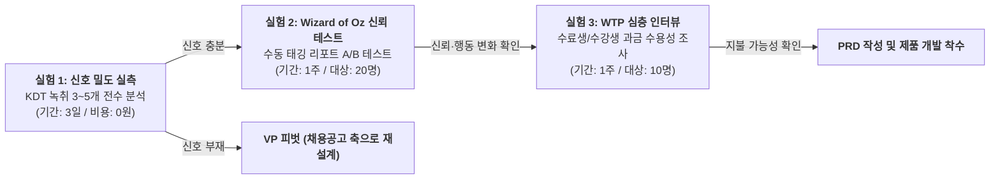

# KOKJIP-VPS-v2_0-rooted

> **문서명:** KOKJIP-VPS-v2_0-rooted (Value Proposition Statement 기준 문서)  
> **문서 목적:** PRD(제품 요구사항 정의서) 작성 및 제품 방향 의사결정의 공식 기준선(Baseline) 수립  
> **기준 시점:** 2026년 8월  
> **문서 상태:** 조건부 가치 가설 수립 단계 (선행 핵심 가설 실측 통과 전까지 PRD 작성 동결)  
> **근거 표기 체계:**  
> - 🟢 **실측·사실**: 공개 통계·경쟁 실사·공식 공시 등 객관적으로 확인된 사실  
> - 🟡 **추론**: 실측 사실을 기반으로 도출한 논리적 구조 분석 및 계산 모델  
> - 🔴 **미검증 가설**: 가치 성립을 위해 실측 검증이 반드시 선행되어야 하는 가설  

---

## 1. Executive Summary & One-Line Positioning

### 1-1. 한 줄 포지셔닝 (One-Line Positioning)

> **콕집은 AI가 학습 내용의 중요도를 자의적으로 판단하는 요약 서비스가 아니라, 강의 중 강사가 실무 중요도를 직접 언급한 발화 시점을 근거(Provenance)로 삼아, 학습자의 가용 시간 예산 안에서 가장 먼저 학습할 핵심 구간을 짚어주는 학습 우선순위 솔루션이다.**

### 1-2. 제품의 본질과 세 가지 가치목표(A·B·C) 위상 정립

```text
[A안: 시간 프레이밍] ──(전달 형식)──> "남은 시간 안에 끝낸다" (진입 마케팅/UI 슬라이더)
         │
         ▼
[B안: 출처 기반 우선순위] ──(코어 가치)──> "강사가 실무 중요도를 직접 말한 순간" (차별화 본체)
         │
         ▼
[C안: 취업 결과 데이터] ──(보류 자산)──> "합격자 학습 이력" (장기 데이터 적립 후 가중치 보정용)
```

1. **가치 B (출처 기반 우선순위 · Core Value) — 코어 가치목표 (조건부 채택)**
   - AI의 자의적 알고리즘 판단이 아닌 **"강사 발화의 실무 강조 신호(Instructor Signal Provenance)"**를 판정 근거로 삼는다.
   - AI는 가치를 스스로 생성하는 주체가 아니라 강사의 전문적 판단을 추출·전달하는 도구로 한정한다.
2. **가치 A (시간 예산 절약 · Delivery Framing) — 전달 형식 (종속 요소)**
   - 학습자의 핵심 Pain(PP-3: "남은 시간에 무엇을 버릴지 결정")에 접근하는 UI 인터페이스이자 진입 메시징이다.
   - 단순 시간 입력 자체는 범용 프롬프트로 재현 가능하므로 독립적 코어 가치가 될 수 없으며, B의 근거를 소비하기 쉬운 형태로 전달하는 프레이밍으로 정의한다.
3. **가치 C (취업/시험 결과 연계 · Outcome Evidence) — 현 단계 VP에서 전면 제외**
   - 9~12개월의 시차, 극소 표본 문제(기수당 수료생 수 제한), 채용 시장 진입 시 발생하는 중립성 훼손(이해상충) 리스크로 인해 현재 VP에서 제외하고 데이터 로그 적립 대상으로만 관리한다.

---

## 2. 표적 고객과 핵심 문제 (Target Customer & Problem)

### 2-1. 표적 고객: 교두보 집단 정의 (3자 역할 생태계)

* **주 사용자 (User):** 고밀도 직무형 부트캠프(K-Digital Training 등 AI·SW·데이터 과정 3~6개월 차)에 참여 중인 비전공 취업준비생 (**김지원, 28세 · Core C1**)
* **주 지불자 (Buyer):** 수료생 취업률 방어 및 이탈 방지가 절박한 훈련기관 운영실장 (**박성호, 45세 · Core C2**)
* **원재료 공급자 (Gatekeeper):** 실무 강의를 진행하며 녹음 허용 권한을 보유한 현직자 강사 (**이준혁, 38세 · Core C3**)

| 타깃 구분 조건 | 선정 및 제외 이유 | 근거 등급 |
|---|---|:---:|
| **일 6~8시간 고밀도 연강 수강** | 매일 대량의 녹음·코드가 누적되어 복습 우선순위 선별 Pain이 집중되는 집단 (L1 KDT 연 37,628명 🟢) | 🟢 사실 (KDT 표준 편성) |
| **직무형 교육 (개발/데이터)** | 이론과 실무의 괴리가 커 현직자 강사의 실무 팁이 높은 정보 가치를 지닌 분야 | 🟡 추론 (산업 구조 분석) |
| **자격증/공시생 제외 (배제 집단)** | 정답과 합격선이 정형화되어 강사의 주관적 실무 강조 신호가 작동하지 않음 (취업준비생의 18.2% 🟢) | 🟡 추론 (시험 구조 분석) |
| **장기 미취업 청년 제외 (배제 집단)** | 태깅할 원천 강의 데이터가 없어 제품의 동작 전제가 성립하지 않음 (1년 이상 60.5만 명 🟢) | 🟢 사실 (제품 작동 조건) |

### 2-2. 고객 여정(CJM) 6단계 Pain & Needs

```text
[1. 수업 직후] ──> [2. 복습 계획] ──> [3. 복습 실행] ──> [4. 맥락 검증] ──> [5. 과제/평가] ──> [6. 프로젝트/취업]
(8시간 누적)       (무엇을 버릴까?)   (배속 청취 낭비)     (환각·의도 오해)     (진도 탈락 위기)     (과거 팁 재탐색 병목)
```

| CJM 단계 | 고객이 겪는 실제 Pain | 고객의 본질적 Needs (Desired Outcome) | 대체재 한계 및 평가 |
|---|---|---|---|
| **1. 수업 직후** | 하루 6~8시간 분량의 음성/자료 누적으로 압도감 발생 | 오늘 반드시 복습해야 할 핵심 분량만 1차 선별 | 단순 전사는 분량 압축 불가 (S=3 보통) |
| **2. 복습 계획 (PP-3)** | 일반 AI 요약은 교재 수준 이론만 나열하고 실무 팁을 누락 | "강사가 실무·면접에서 쓰인다고 한 내용" 중심 필터링 | **AOS 3.00 1위** (S=1 매우 불만) |
| **3. 복습 실행** | "강사가 중요하다고 했던 구간"을 찾으려 배속 재청취로 시간 낭비 | 실무 강조 발화 지점으로 1클릭 즉시 이동 | 타임스탬프 없는 텍스트 한계 (S=2 불만) |
| **4. 맥락 검증** | AI 텍스트 요약만 보면 코드 작성 맥락이나 강사 뉘앙스 오해 | 요약 텍스트와 원천 오디오의 1:1 동기화 검증 | LLM 환각(Hallucination) 불안 (S=1 매우 불만) |
| **5. 과제/평가** | 누적된 복습 실패로 과제 미제출 및 중도 탈락 위기 직면 | 중요도 높은 핵심 코드부터 빠르게 완결 | 훈련기관 조기 경보 감지 영역 |
| **6. 프로젝트 (PP-6)** | 프로젝트 구현 중 과거 강사가 지나가듯 말한 핵심 팁을 못 찾음 | 키워드 기반 원천 강의 구간 즉시 역검색 | **과금 발생 접점** (S=1 불만 극대화) |

### 2-3. 핵심 Pain의 구조 (PP-3)

> **핵심 Pain (PP-3): "남은 시간 안에 무엇을 버리고 무엇을 먼저 볼지 결정하기 어렵다."**  
> *(근거: 17개 대표 Pain 중 **AOS 3.00, DOS(SAM) 3.00으로 전체 1위** 🟡)*

- **문제의 본질:** 학습자가 겪는 핵심 고통은 '정보량 부족'이나 '요약 텍스트의 부재'가 아니다. **"제한된 시간 안에서 무엇을 우선하고 무엇을 버려야 하는지 스스로 판단할 수 없다"는 인지적 판단 비용과 불안감(FOMO)**이다.
- 비전공자는 지식 체계가 확립되어 있지 않아 스스로 약점을 선별하기 어렵다. 따라서 외부 실무 전문가(강사)의 명시적 판단 신호가 복습의 기준점이 되어야 한다.

---

## 3. 고객 Desired Outcome & JTBD

### 3-1. 궁극적 Outcome vs KOKJIP 직접 기여 Outcome

- **궁극적 Desired Outcome:** 제한된 훈련 기간(3~6개월) 내에 기업 채용 기준에 부합하는 실무 역량을 확보하여 취업에 성공하는 것.
- **KOKJIP 직접 기여 Outcome:** 불필요한 강의 탐색 시간을 제거하고, 강사가 강조한 실무 핵심 구간을 가용 시간 내에 우선 복습하여 과제 및 프로젝트에 적용하는 것.

### 3-2. JTBD (Job-to-be-Done) 체계

```text
[Core Functional Job]
When: 하루 6~8시간 강의 수강 후 복습 가용 시간이 1~2시간에 불과할 때,
I want to: 강사가 실무 중요도나 면접 빈출을 직접 언급한 핵심 발화 구간만 선별하여,
So I can: 교과서적 이론 나열 대신 현직자의 실무 노하우를 빠르게 학습하고 과제에 적용할 수 있다.

[Supporting Job (Time-Anchored Navigation)]
When: 요약 텍스트만으로 강사의 의도나 코드 작성 맥락이 불분명할 때,
I want to: 태깅된 타임스탬프를 통해 원천 오디오 해당 지점으로 즉시 이동하여,
So I can: 탐색 시간을 낭비하지 않고 원문 맥락을 100% 검증할 수 있다.

[Emotional Job]
강사가 지나가듯 전달한 핵심 실무 팁을 놓쳤을지도 모른다는 불안감 없이 명확한 우선순위로 복습한다.

[Social Job]
기초 이론만 단순 암기한 지원자가 아닌, 실무 관점의 중요도를 이해하고 코드를 작성하는 지원자로 준비된다.
```

---

## 4. 기존 대안과 한계 (Competitors & Alternatives)

### 4-1. 경쟁 및 대체재 지형 실사 요약

| 경쟁 경로 | 대표 사업자 | 시장 지위 및 비즈니스 모델 | 콕집 관점의 위협 및 구조적 한계 | 근거 등급 |
|---|---|---|---|:---:|
| **A. 정면 경쟁** | **다글로** | 시리즈B 60억(누적 200억) 🟢<br>B2C 구독 + B2B API | "대학생 맞춤형 AI", 퀴즈 생성 보유 🟢. 그러나 **실무 중요도 축이 없고** 단순 받아쓰기·범용 요약에 집중 🟡 | 🟢 공개 실적<br>🟡 기능 분석 |
| **B. 무료 번들** | **클로바노트** | 가입자 100만 이상, 노트 3,000만 🟢<br>개인 무료(월 300~600분) | 네이버 인프라 기반 무료 공급. **카테고리 지불 가격을 0원으로 수렴시킴** 🟡. 단, 복습 우선순위 선별 기능 부재 | 🟢 공개 실적<br>🟡 가격 구조 분석 |
| **B. 무료 번들** | **Gemini Notebook** | 3,000만 유저, 60만 조직 🟢<br>Google 생태계 무료 | 소스 그라운딩, 학습 가이드·퀴즈 무료 제공 🟢. **단순 요약/퀴즈 기능은 이미 0원에 무료 공급됨** 🟡 | 🟢 공개 실적<br>🟡 기능 분석 |
| **C. 카테고리 리더** | **Otter.ai** | ARR 1억 달러($100M) 돌파 🟢<br>글로벌 회의록 SaaS | 회의/강의 전사 리더이나, **제3자 음성 녹음 관련 집단소송 직면** 🟢 → 음성 데이터 수집의 법적·윤리적 가드레일 필요성 입증 | 🟢 공개 실적/소송 |
| **D. 신뢰 특화** | **티로(Tiro)** | 시드 8억, B2B 엔터프라이즈 SaaS | **"데이터 미보유/학습 미사용/즉시 파기"** 보안 정책으로 B2B 수주 🟢. 기관 도입 시 필수적인 데이터 프라이버시 기준선 제시 | 🟢 실사 확인 |
| **E. 습관 선점** | **노션(Notion)** | 1억 사용자 🟢, 학생·교원 무료 🟢 | 학생 무료 배포로 학습 정리 도구로서의 전환비용 장악 🟡 | 🟢 공개 지표<br>🟡 전환비용 분석 |
| **F. 지불자 장악** | **엘리스** | 2024 매출 351억, 영업익 134억 🟢<br>50개 이상 대학·기관 LXP 공급 | **KDT 훈련기관 및 대학을 LXP로 장악한 플랫폼** 🟢. 향후 유통 파트너 또는 잠재적 경쟁자 위치 | 🟢 공시 실적 |
| **G. 공급자 통합** | **패스트캠퍼스** | 2025 매출 1,239억 🟢 (데이원컴퍼니)<br>KDT 교육과정 직접 운영 | KDT 훈련 직접 운영사. 필요 시 학습 보조 기능을 자체 내재화할 수 있는 잠재적 공급자 위협 🟡 | 🟢 공시 실적<br>🟡 구조 분석 |

### 4-2. 무료 AI 및 범용 요약 도구의 한계

```text
[범용 무료 요약 도구 / LLM]              [KOKJIP (출처 기반 우선순위)]
- "오늘 강의 내용 요약 10줄입니다."         - "오늘 8시간 중 기본 이론을 제외하고,
- 무엇을 버려야 할지 판단하지 못함            강사가 '실무 필수'라 강조한 8개 구간
  (버릴 근거가 없어 임의 삭제 불가)           (47분 분량)부터 먼저 학습하세요."
- 원천 오디오 맥락과의 단절                - 텍스트 클릭 시 해당 발화 오디오로 즉시 이동
```

1. **'버릴 것'을 결정하지 못함:** 기존 요약 도구는 정보의 길이를 줄일 뿐, "이 내용은 안 봐도 된다"는 배제의 결정을 내리지 못한다. 잘못 버렸을 때의 책임을 질 수 있는 판정 근거가 없기 때문이다.
2. **출처와 맥락의 단절:** AI가 생성한 요약 텍스트는 원천 음성과 분리되어 있어, 강사의 미묘한 조건부 설명이나 뉘앙스를 파악하려면 결국 전체 음성을 다시 찾아 헤매야 한다.
3. **신뢰의 주체 결핍:** 학습자는 "AI가 중요하다고 판단한 내용"보다 "현직자 강사가 실무에서 쓰인다고 강조한 내용"을 신뢰한다.

---

## 5. KOKJIP Core Value Proposition & 차별점

### 5-1. Value Proposition Statement

> **"하루 6~8시간의 강의를 모두 복습할 수 없는 부트캠프 수강생에게, 콕집은 강사가 실무와 면접에서 중요하다고 직접 강조한 발화를 근거로 복습 우선순위를 추출하여, 남은 시간 예산 안에서 핵심 구간부터 1클릭으로 탐색·학습할 수 있게 돕는다."**

### 5-2. 차별화 메커니즘 (Provenance vs Intelligence)

```text
[기존 에듀테크 / AI 도구]                    [KOKJIP]
 입력 데이터 (강의 음성/자료)                   입력 데이터 (강의 음성)
         │                                            │
         ▼                                            ▼
  AI의 자의적 지능 판단                         강사의 구어체 강조 신호 포착
 ("AI 알고리즘이 보기에 중요함")                ("실무에선 이거 씁니다", "면접 빈출")
         │                                            │
         ▼                                            ▼
 텍스트 요약본 생성                            원천 오디오 타임스탬프 동기화 (Audio Provenance)
 (근거 불명, 신뢰 부족)                        (판단 주체: 강사 / AI: 신호 추출 도구)
```

- **판단 출처(Provenance)의 차별화:** AI 지능의 우수성을 주장하지 않고, **AI가 판단 주체에서 물러나 강사의 실제 발화를 판정 근거로 제시**함으로써 신뢰성을 확보한다.
- **이해관계자(학습자·강사·기관) 마찰 최소화:**
  - **학습자:** 실무 현직자인 강사의 발화 권위에 기반한 명확한 복습 우선순위 획득.
  - **강사:** 강의에 대한 외부의 자의적 평가나 검열이 아니라, 강사 본인의 발화 권위를 존중·강조하므로 반발 최소화.
  - **기관:** 강사와의 마찰 없이 수강생의 복습 완수율 및 학업 이탈 방지 도구로 활용 가능.

### 5-3. 4대 판정 근거 후보 비교 및 시점별 로드맵

| 근거 후보 | 확보 시점 | 데이터 해상도 | 방어력 | 설명력 | 현 단계 전략적 포지션 |
|---|:---:|:---:|:---:|:---:|---|
| **① 채용공고 기술 수요** | 즉시 🟢 | 중 (기술 스택 단위) | 낮음 | 높음 | **신뢰 보조 레이어로 병행 검토** |
| **② 개발자 커뮤니티/문서** | 즉시 | 중 (일반 모범사례) | 낮음 | 보통 | **제외** (범용 LLM 사전학습 데이터와 차별점 없음) |
| **③ 합격자 학습 이력** | 9~12개월 후 | 높음 (개인별 패턴) | **높음** | 높음 | **현 단계 VP 제외 (장기 데이터 적립 대상)** |
| **④ 강사 강의 발화 신호** | **즉시 🟢** | **높음 (강의 맥락 일치)** | **보통** | **높음** | **MVP 핵심 1차 판정 근거 (조건부 채택)** |

---

## 6. 가치 주장과 근거 수준 (Grounding Matrix)

| # | 핵심 판단 및 가치 주장 | 근거 수준 | 구체적 근거 및 성격 |
|---|---|:---:|---|
| 1 | 학습자는 남은 시간에 무엇을 버릴지 결정하고 싶어 한다 | 🟡 **추론** | 고객 여정 분석 모델 상 결핍 점수 1위 (AOS 3.00, DOS 3.00) |
| 2 | KDT 부트캠프 취업률 하락으로 기관의 성과 위기감이 증가했다 | 🟢 **실측** / 🟡 **추론** | 고용노동부 공시 KDT 취업률: 2022년 62.6% → 2024년 54.2% (공시 통계 🟢) 기반 기관 심리 추론 🟡 |
| 3 | 경쟁 8개사 중 강의의 '버릴 것(우선순위)'을 선언한 도구는 없다 | 🟢 **실측** | 8개 사업자 서비스 기능 및 가치 선언 실사 완료 |
| 4 | 무료 번들(클로바노트·노션·Gemini)로 인해 단순 전사·요약 가격은 0원에 수렴한다 | 🟢 **실측** | 네이버 월 300~600분 무료, Google 소스 그라운딩·퀴즈 무료 배포 |
| 5 | 단순 시간 입력 UI만으로는 독자적 차별성을 확보하기 어렵다 | 🟡 **추론** | 범용 LLM 프롬프트 한 줄로 재현 가능한 기능 구조 분석 |
| 6 | 강사 발화 출처 제시가 AI 요약보다 학습자 신뢰도가 높을 것이다 | 🟡 **추론** | 비전공자의 현직자 권위 의존 심리 및 면접 준비 맥락 분석 |
| 7 | 원천 오디오 타임스탬프 동기화가 탐색 시간을 유의미하게 단축한다 | 🟡 **추론** | STT 전사 텍스트 클릭 시 해당 재생 지점 1:1 매핑 UI 구조 분석 |
| 8 | **실제 직무 강의에서 강사의 실무 강조 발화가 충분한 빈도로 발생한다** | 🔴 **미검증 가설** | **최우선 선행 가설 1 (Signal Density) — 시간당 발생 빈도 미실측** |
| 9 | **수강생이 강사 발화 기반 우선순위를 신뢰하고 실제 복습 행동을 변경한다** | 🔴 **미검증 가설** | **핵심 선행 가설 2 (Evidence Trust) — 사용자 행동 변화 미검증** |
| 10 | **특정 학습 시점(예: 프로젝트 수행)에 수강생의 유료 지불 의사(WTP)가 발생한다** | 🔴 **미검증 가설** | **수익성 가설 (Monetization) — 유료 전환율 및 단가 수용성 미실측** |
| 11 | **훈련기관이 수강생 관리 목적으로 본 솔루션 도입 예산을 배정한다** | 🔴 **미검증 가설** | **B2B 가설 — 기관 구매 의사 및 예산 과목 배정 미실측** |

---

## 7. 핵심 미검증 가설 및 선행 검증 계획 (Validation Plan)

### 7-1. 최우선 검증 가설 3선

```text
[가설 1: Signal Density (존재 조건)] ──> [가설 2: Evidence Trust (신뢰 조건)] ──> [가설 3: Monetization (지불 조건)]
강의 음성에 실무 강조 신호가 존재하는가?     학습자가 이를 믿고 복습 순서를 바꾸는가?     어느 시점에 유료 지불 의사가 발생하는가?
(선행 필수 판정 게이트)                      (A/B 비교 실험)                             (인터뷰 기반 WTP 확인)
```

#### 가설 1. 강사 발화 신호 밀도 (Signal Density — 최우선 검증 병목)
- **가설 내용:** 실제 직무형(KDT 등) 강의에서 강사가 실무 중요도, 현업 관행, 면접 빈출을 직접 언급하는 구어체 강조 신호가 정기적으로 발생한다.
- **판정 영향:** 신호가 충분히 존재해야 가치 B(강사 발화 근거)가 제품의 핵심 기반으로 성립함. 신호가 거의 없다면 가치 B는 붕괴되며, 채용공고 기반(가치 ①) 등 대체 축으로 VP를 전면 재설계해야 함.

#### 가설 2. 출처 신뢰 및 행동 변화 (Evidence Trust)
- **가설 내용:** 학습자는 "AI가 판단한 일반 요약"보다 "강사의 실무 언급 시점과 발화 내용"을 더 신뢰하며, 실제 복습 우선순위를 변경한다.
- **판정 영향:** 출처 제시가 학습자의 신뢰와 실제 행동 변화를 이끌어내지 못한다면 일반 무료 요약 도구 대비 차별화 가치가 무효화됨.

#### 가설 3. 유료 지불 의사 발생 시점 (Monetization Timing & WTP)
- **가설 내용:** 무료 도구에 만족하는 일상 강의 청취 시점에는 지불 의사가 낮으나, 과거 학습 내용을 집약해 결과물을 내야 하는 프로젝트 수행 시점에는 지불 의사가 발생한다.
- **판정 영향:** 유료화가 가능한 기능 범위와 과금 시점(B2C 구독 vs 프로젝트 패스 vs B2B 라이선스)을 결정함.

---

### 7-2. 선행 검증 실험 설계 (PRD 착수 전 실행 게이트)



| 실험 항목 | 검증 대상 | 실험 방법 | 임시 실험 판정 기준 (기준선) | 기준 미달 시 대응 경로 |
|---|---|---|---|---|
| **실험 1**<br>Signal Density | 가설 1 | KDT 실제 강의 녹취 3~5개(15~25시간 분량)에서 강사 구어체 실무 강조 발화 전수 카운팅 | **시간당 평균 ≥ 2.0회:** B가치 확정<br>**시간당 평균 0.5~1.9회:** 신호 정의 범위 조정<br>**시간당 평균 ≤ 0.2회:** B가치 기각 | B가치 폐기, 채용공고 기반 산업 기술 수요를 1차 근거로 하는 대체 VP로 전환 |
| **실험 2**<br>Evidence Trust | 가설 2 | 20명 수강생 대상 Wizard of Oz 블라인드 A/B 테스트:<br>- A안: 일반 AI 요약 리포트<br>- B안: 강사 발화 인용 + 타임스탬프 리포트 | 참가자의 대다수(예: 70% 이상)가 B안을 신뢰하고 실제 복습 우선순위로 채택 | 강사 발화 단독 인용 외에 채용공고 기술 키워드 매칭 시각화를 결합하여 보완 |
| **실험 3**<br>WTP 조사 | 가설 3 | KDT 수강생 및 수료생 10명 대상 심층 인터뷰: 프로젝트 시점 과거 강의 재탐색 고통 경험 및 지불 의사 확인 | 인터뷰 대상 다수(예: 과반)가 프로젝트 시점 핵심 탐색 기능에 유료 결제 의사 표명 | 개인 B2C 모델을 축소하고 기관 B2B 라이선스 중심 모델로 전환 검토 |

*(※ 위 판정 기준의 수치는 시장 통계나 확정 KPI가 아니며, 가치 가설의 유효성을 판단하기 위해 설정한 실험용 임계값임)*

---

## 8. MVP Job-Feature Map & 제품 범위 (Scope)

### 8-1. Pain → Outcome → Value → Feature 정렬 맵

| Customer Pain | Desired Outcome | KOKJIP Value | 대응 Feature | MVP 우선순위 |
|---|---|---|---|:---:|
| **밀린 강의 중 무엇이 중요한지 모름 (PP-3)** | 오늘 반드시 볼 핵심만 선별 | 강사 발화 출처 기반 실무 중요도 판정 | **강사 구어체 실무 강조 발화 태깅 엔진** | **P0 (핵심 필수)** |
| **AI 요약의 환각·의도 오해 불안** | 강사 발화 원문 맥락을 즉시 확인 | Audio Provenance (출처 신뢰) | **태그 클릭 시 1:1 오디오 즉시 재생 앵커** | **P0 (핵심 필수)** |
| **배속 재청취로 인한 시간 낭비** | 중요 구간으로 즉시 이동 | Time-Anchored Navigation | **Audio-Text 동기화 타임라인 플레이어** | **P0 (핵심 필수)** |
| **남은 시간에 맞춘 학습 분량 압축** | 가용 시간 내 학습 완료 | 가용 시간 맞춤형 필터링 | **가용 시간 입력 슬라이더 UI** | **P1 (차기)** |
| **텍스트 외 강사 억양/음량 강조 누락** | 비언어적 강조점 포착 | 하이브리드 중요도 감지 | **음향(Acoustic) 피치/데시벨 분석** | **P1 (차기)** |
| **프로젝트 시점 복습 내용 망각 (PP-6)** | 프로젝트 구현 중 과거 팁 즉시 호출 | 맥락 재소환 | **프로젝트 키워드 기반 강의 구간 역검색** | **P1 (차기)** |
| **강의 자료 유출 및 저작권 우려 (PP-N1)** | 강사/기관의 안심 도입 | Data Containment (신뢰 기본선) | **음성 전사 후 원본 즉시 폐기 & 학습 미사용** | **P0 (핵심 필수)** |

### 8-2. MVP 포함 및 제외 범위

- **P0 (MVP 포함 — 가설 1·2 검증 최소 기능):**
  1. 강의 오디오 파일 업로드 및 STT 텍스트 전사
  2. 강사 실무 강조 발화 키워드/패턴 감지 엔진
  3. 태그-오디오 1:1 동기화 웹 플레이어 (클릭 시 해당 시점 오디오 즉시 재생)
  4. 데이터 보안 처리 (전사 완료 즉시 원본 오디오 휘발성 삭제)
- **P1 (차기 검토 — MVP 검증 완료 후):** 가용 시간 슬라이더 UI, 프로젝트 역검색, 음향 분석.
- **Out of Scope (현 단계 개발 제외):**
  - AI 퀴즈 및 플래시카드 자동 생성 (무료 도구와의 중복 배제)
  - 취업 포트폴리오 자동 완성 및 기업 채용 매칭 (가치 C 제외 원칙)
  - 강사별 평가 점수 및 등급 산출 (공급자 마찰 유발 방지)

---

## 9. 비즈니스 모델 및 진입 가설 (GTM & Monetization Hypothesis)

*(※ 본 섹션은 세부 실행 계획이 아니며, Value Proposition 검증에 필요한 시장 진입 가설과 기본 제약 조건을 요약함)*

### 9-1. 무료 경쟁 회피와 과금 접점 가설 (112배 단가 격차 반영)

- **무료 경쟁 구간 회피:** 클로바노트·노션 등 무료 조합에 만족하는 일상 강의 청취 시점(④ 도구 탐색기, S=3)에서는 마케팅 비용을 투입하지 않는다.
- **과금 접점 가설:** 배운 내용을 실제 프로젝트에 적용해야 하지만 과거 강의 위치를 찾지 못해 병목을 겪는 시점(⑥ 프로젝트 수행기, PP-6, S=1)에 유료 전환 가치가 발생할 것으로 가설을 수립한다.

### 9-2. B2B 기관 도입의 역할 (배포 관문)

- **배포 관문으로서의 기관:** 개인 지불(월 5,000원)과 기관 지불 간 112배 단가 격차가 존재하므로, KDT 훈련기관과의 제휴를 통해 입과 시점에 솔루션을 일괄 배포하는 방식을 핵심 유통 가설로 설정한다.
- **기관 소구 가치:** 단순 "수강생용 복습 도구"가 아닌 "수강생 취업률(54.2% 🟢) 방어 및 학업 이탈 조기 감지" 관점의 가치(PP-K1)를 제공하는 방향으로 포지셔닝한다.

### 9-3. 필수 신뢰 및 데이터 보호 원칙

- **강사 저작권 보호:** 강의 녹화물 및 실연권에 대한 강사의 권리를 존중하며, 강사의 거부 권리를 보장하는 운영 원칙을 수립한다 (UMass/UCL 글로벌 표준 🟢).
- **제3자 음성 프라이버시 보호:** Q&A 시 섞이는 동료 수강생 음성은 비식별화하거나 전사 대상에서 제외한다 (Otter.ai 집단소송 리스크 선제 방어 🟢).
- **데이터 완전 격리:** 전사 후 오디오 원본을 즉시 폐기하고, 사용자 데이터를 AI 모델 학습에 사용하지 않는다 (티로 모델 벤치마킹 🟢).

---

## 10. 커뮤니케이션 가드레일 (Communication Guardrails)

| ❌ 절대 금지 표현 (Prohibited) | 금지 사유 | ✅ 공식 권장 표현 (Recommended) |
|---|---|---|
| "AI가 강의에서 중요한 내용을 골라줍니다." | AI 임의 판단으로 오인 유발, 신뢰도 하락 및 범용 AI와 차별점 소멸 | **"강사님이 실무에서 중요하다고 강조한 구간을 찾아드립니다."** |
| "강의에서 불필요한 내용을 잘라내 버립니다." | 강사 권위 훼손 및 교육기관 반발 초래 | **"학습자의 가용 시간에 맞춰 가장 먼저 볼 구간을 정해드립니다."** |
| "콕집을 쓰면 취업이 보장됩니다." | 인과관계 입증 불가 (가치 C 배제 원칙 위반) | **"현직자 강사의 실무 감각과 팁을 놓치지 않고 복습합니다."** |
| "AI가 요약 노트와 퀴즈를 만들어 드립니다." | Gemini Notebook/다글로 등 무료 도구와 혼동 유발 | **"강사의 실제 발화를 근거로 복습 우선순위를 세워드립니다."** |

---

## 11. Strategic Verdict & 다음 단계 의사결정 (Next Decisions)

### 11-1. 현 시점 4대 영역 종합 판정

1. **현재까지 확실히 확인된 것 (Facts):**
   - 부트캠프 수강생에게 '복습 시간 부족'과 '버릴 것 선별의 어려움'은 실재하는 문제다.
   - 네이버(클로바노트), 구글(Gemini Notebook) 등 빅테크 무료 번들로 인해 단순 전사·요약 기능의 시장 가격은 0원이다.
   - 기존 시장의 경쟁 8개사 중 '강사 발화 출처 기반 우선순위(뺄셈)'를 핵심 가치로 선언한 사업자는 없다.
2. **현재 가장 유력한 Value Proposition 가설 (Core Hypothesis):**
   - **"AI의 자의적 요약이 아닌, 강사의 구어체 실무 강조 발화(Provenance)를 근거로 복습 우선순위를 제시하고 원천 오디오로 즉시 연결하는 것"**이 유일하게 유효한 차별화 경로다.
3. **가장 중요한 미검증 가설 (Critical Unknowns):**
   - **Signal Density:** 실제 강의에서 강사의 실무 강조 발화가 분석에 유의미한 빈도로 존재하는가?
   - **Evidence Trust:** 학습자가 강사 발화 출처 태그를 보고 실제 복습 우선순위를 변경하는가?
   - **Monetization:** 학습자 또는 교육기관이 이 기능에 대해 실제 유료 지불 의사를 가지는가?
4. **다음 단계 검증 후 PRD 전환 계획 (Validation Gate):**
   - 현재 상태는 **"개발에 착수할 준비가 완료된 상태"가 아니라 "핵심 가치 가설을 소규모 실험으로 실측해야 하는 상태"**다.
   - 아래 2단계 검증 실험을 완료하고 판정 기준을 충족한 후에만 PRD 작성 및 MVP 개발 스프린트로 전환한다.

---

### 11-2. PRD 착수 전 검증 게이트 (Gate Decision)

```text
[Step 1: 선행 가설 실측] ─────────> [Gate 판정] ─────────> [Step 2: PRD 확정 및 MVP 개발]
 1) KDT 녹취 3~5개 신호 밀도 실측       밀도 충족 & 신뢰 확인: Go       - P0 기능 중심 PRD 작성
 2) 수강생 20명 대상 A/B 테스트         신호 부재/신뢰 미달: Pivot     - Audio-Sync 플레이어 구현
 3) 수강생/수료생 WTP 인터뷰
```

- **Go 판정 기준:**
  - 실제 KDT 강의 녹취 분석 결과 강사 실무 강조 신호가 확인됨 (실험 기준선: 시간당 평균 ≥ 2.0회).
  - A/B 테스트에서 강사 발화 기반 리포트에 대한 사용자 신뢰 및 우선순위 채택이 확인됨.
  - **→ 충족 시: 본 VPS 문서를 기준으로 즉시 PRD 작성 및 P0 MVP 개발 착수.**
- **Pivot 판정 기준:**
  - 강사 강조 신호 발생 빈도가 극히 희박함 (실험 기준선: 시간당 평균 ≤ 0.2회).
  - **→ 미달 시: 가치 B를 폐기하고, 채용공고 기반 산업 기술 수요를 1차 근거로 하는 대체 가치 제안으로 전면 피벗.**
