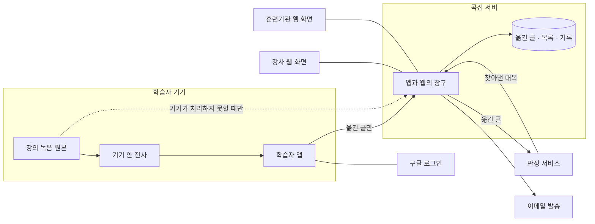
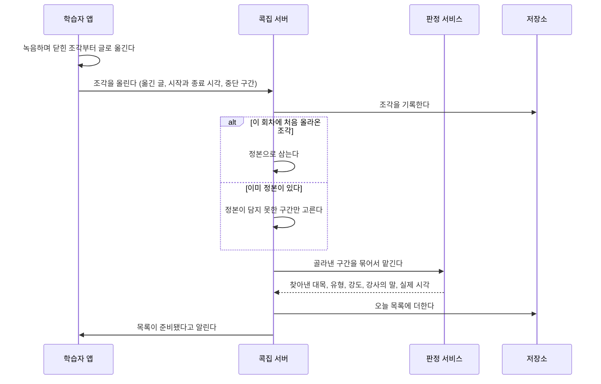
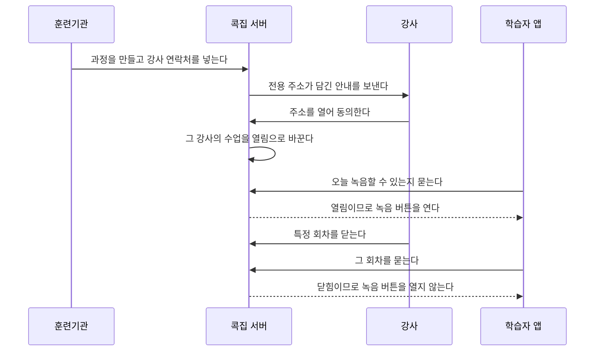
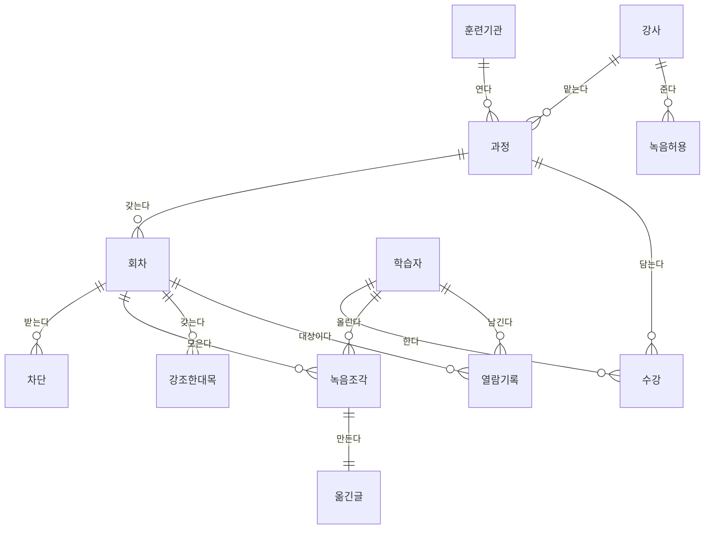
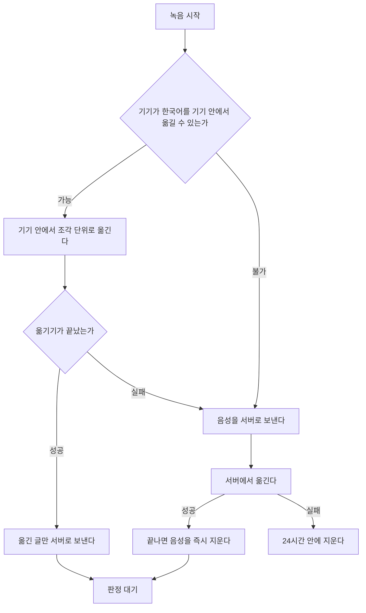
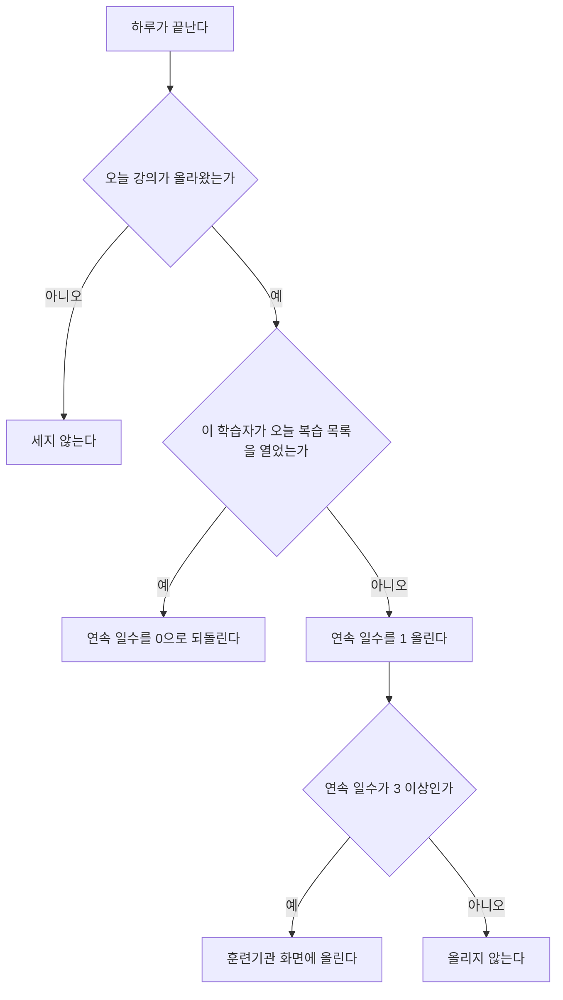

# 콕집 시스템 요구사항 정의서

| | |
|---|---|
| 문서 종류 | 시스템 요구사항 정의서 |
| 버전 | 1.1 |
| 기준 시점 | 2026년 9월 |
| 답하는 질문 | 무엇을 만족해야 하는가 |
| 앞 문서 | 제품 요구사항 정의서 |

이 문서는 요구사항마다 번호와 근거와 수용 기준을 붙인다. 근거는 제품 요구사항 정의서의 장 번호와 착수 전 결정의 번호를 가리킨다. 수용 기준은 만족했는지를 확인할 수 있는 문장으로 쓴다.

---

# 1. 기술 스택

## 1-1. 확정 스택

| 레이어 | 선택 |
|---|---|
| 서버와 웹 화면 | Next.js App Router 단일 풀스택 |
| 언어 (서버와 웹) | TypeScript, 엄격 설정 |
| 학습자 앱 | Kotlin과 Jetpack Compose, 안드로이드 전용 |
| 녹음과 기기 전사 | 안드로이드의 기기 전용 음성 인식기를 직접 호출 |
| 데이터베이스 | Prisma와 Supabase PostgreSQL |
| 입력 검증 | Zod |
| 강조한 대목 판정 | Claude `claude-opus-5`, 묶음 호출 |
| 묶음 작업 예약 | Supabase `pg_cron` |
| 웹 화면 꾸미기 | Tailwind CSS와 shadcn/ui |
| 앱 화면 꾸미기 | Jetpack Compose 기본 구성 요소 |
| 알림 | 안드로이드 푸시 알림 |
| 테스트 | Vitest, Playwright, 안드로이드 계측 테스트 |
| 학습자 로그인 | 구글 계정 로그인 |
| 이메일 발송 | 무료 구간의 발송 서비스 |
| 인프라 | Vercel과 Supabase 무료 구간 |

## 1-2. 금지 스택

| 금지 | 이유 |
|---|---|
| 별도 백엔드 서버 | 서버를 하나로 유지한다 |
| 운영체제의 기본 음성 인식기 | 음성을 제조사 서버로 보낼 수 있다 |
| 클라우드 전사를 기본 경로로 쓰는 구성 | 예외 경로에만 쓴다 |
| 서버에 원본 음성을 남기는 어떤 구성 | 보관하지 않는다는 규칙을 깬다 |
| 앱에 외부 서비스 접속 열쇠를 넣는 구성 | 열쇠가 새면 비용과 책임이 우리에게 온다 |
| 화자 분리 | 누가 말했는지에 대한 정보를 만들지 않는다 |
| 위치 정보를 다루는 부품 | 이 제품에 쓸 데가 없다 |
| 학습자 개인 결제 부품 | 값은 훈련기관이 낸다 |
| 아이폰용 구성 | 이번 범위 밖이다 |
| 문자 인증과 간편인증 | 공급자 계약과 기관 심사가 붙고 건당 비용이 든다. 필요한 것은 법적 본인확인이 아니라 명단 대조다 |

## 1-3. 만드는 단계

| 단계 | 범위 |
|---|---|
| 1단계 | 웹. 옮긴 글과 음성 파일을 올리는 지점부터 시작한다. 판정, 복습 목록, 지점 재생, 옮긴 글 전체 보기, 강사 동의와 회차 차단, 훈련기관 화면까지 만든다 |
| 2단계 | 안드로이드 앱. 녹음과 기기 전사를 더한다. 1단계에서 만든 서버와 창구를 그대로 부른다 |

두 단계가 같은 서버를 쓴다. 각 요구사항이 어느 단계에 속하는지는 9장 목록에 표시한다.

---

# 2. 시스템 범위와 경계

## 2-1. 시스템 맥락도

이어진 선은 늘 흐르는 길이고, 점선은 기기가 전사를 하지 못할 때만 열리는 길이다.

## 2-2. 경계 위에 놓인 것

| 대상 | 어디에 있는가 |
|---|---|
| 강의 녹음 원본 | 학습자 기기에만 있다. 서버에 보관하지 않는다 |
| 옮긴 글 | 서버에 있다 |
| 복습 목록과 열람 기록 | 서버에 있다 |

## 2-3. 바깥에 있는 것

| 대상 | 하는 일 |
|---|---|
| 판정 서비스 | 옮긴 글에서 강사가 강조한 대목을 찾는다 |
| 구글 로그인 | 학습자가 누구인지를 확인해 준다 |
| 이메일 발송 | 강사에게 동의 안내를 보내고 훈련기관 담당자의 비밀번호 되찾기를 처리한다 |
| 안드로이드 푸시 알림 | 복습 목록이 준비됐음을 알린다 |

---

# 3. 사용자와 권한

| 주체 | 쓰는 것 | 들어오는 방법 | 할 수 있는 일 |
|---|---|---|---|
| 학습자 | 안드로이드 앱 | 초대 링크로 앱을 열고 구글 계정으로 로그인 | 녹음, 올리기, 복습 목록 보기, 다시 듣기, 옮긴 글 보기 |
| 강사 | 웹 화면 | 계정 없이 본인 전용 주소 | 녹음 허용 동의, 회차 단위 차단 |
| 훈련기관 담당자 | 웹 화면 | 이메일과 비밀번호 | 뒤처지는 수강생 보기 |

권한 규칙은 다음과 같다.

- 학습자의 소속은 하나다. 한 학습자가 동시에 두 훈련기관에 속하지 않는다.
- 초대 명단에 있는 이메일로 로그인한 사람만 들어온다.
- 강사의 전용 주소는 추측할 수 없어야 하고 유효 기간이 있다.
- 훈련기관 담당자는 자기 기관의 과정만 본다.

---

# 4. 전체 동작 흐름

## 4-1. 녹음부터 복습 목록까지

## 4-2. 강사 동의와 녹음 열림

---

# 5. 데이터 구조

## 5-1. 개체 관계도

## 5-2. 개체 설명

| 개체 | 담는 것 |
|---|---|
| 훈련기관 | 기관 이름과 담당자 계정 |
| 과정 | 시작일, 종료일, 맡은 강사, 정원 |
| 회차 | 날짜. 올라온 녹음의 날짜로 만든다 |
| 수강 | 학습자가 어느 과정에 속하는지, 들어온 달과 나간 달 |
| 학습자 | 이름과 이메일 |
| 강사 | 이름과 이메일, 전용 주소와 그 유효 기간 |
| 녹음허용 | 강사가 동의한 시각과 동의한 범위 |
| 차단 | 강사가 닫은 회차 |
| 녹음조각 | 올린 학습자, 시작과 종료 실제 시각, 중단 구간, 정본 여부 |
| 옮긴글 | 조각에서 나온 글과 블록별 실제 시각. 화자 항목은 없다 |
| 강조한대목 | 유형, 강도, 강사의 말, 실제 시각 |
| 열람기록 | 학습자가 복습 목록을 연 시각 |

한 회차에 정본은 하나이고 녹음조각은 여럿이다. 판정은 정본과 정본이 담지 못한 구간에만 돈다.

---

# 6. 기능 요구사항

## REQ-FUNC-001 강사 녹음 허용 동의

**근거** 제품 요구사항 정의서 6-1 · 착수 전 결정 T3

**내용** 제품이 강사에게 전용 주소가 담긴 안내를 보낸다. 강사는 그 주소를 열어 동의한다. 동의할 때 무엇을 녹음하도록 허용하는지, 녹음에서 무엇을 글로 옮기는지, 옮긴 글을 언제까지 보관하는지, 특정 회차를 막을 수 있다는 것을 함께 보여준다.

**수용 기준**

- 훈련기관이 강사 이메일을 넣으면 안내가 발송된다.
- 전용 주소는 추측할 수 없는 값이고 유효 기간이 있다.
- 유효 기간이 지난 주소를 열면 동의 화면이 나오지 않고 다시 보내기를 안내한다.
- 동의 화면에 위 네 가지 항목이 모두 보인다.
- 동의하지 않은 강사에게 정해진 간격으로 다시 안내가 발송된다.

## REQ-FUNC-002 강사 회차 차단

**근거** 제품 요구사항 정의서 6-2 · 착수 전 결정 T3

**내용** 강사가 특정 회차의 업로드를 막는다. 기본 상태는 열림이다.

**수용 기준**

- 강사가 동의한 뒤 전용 주소에서 회차 목록을 보고 개별 회차를 닫을 수 있다.
- 닫힌 회차는 학습자 화면에 녹음 버튼이 나오지 않는다.
- 닫은 회차를 다시 열 수 있다.
- 새로 만들어지는 회차의 기본 상태는 열림이다.

## REQ-FUNC-003 학습자 계정 생성과 로그인

**근거** 제품 요구사항 정의서 3 · 착수 전 결정 T1 · S6

**내용** 학습자가 초대 링크로 앱을 열고 구글 계정으로 로그인한다. 초대 명단에 있는 이메일로 로그인한 사람만 들어온다.

**수용 기준**

- 초대 명단에 없는 이메일로는 로그인이 완료되지 않는다.
- 확인이 끝나면 그 학습자가 해당 과정에 속한 것으로 기록된다.
- 앱을 지우고 다시 깔아도 같은 구글 계정으로 계정을 되찾는다.
- 한 학습자가 동시에 두 과정에 속할 수 없다.

## REQ-FUNC-004 녹음과 기기 전사

**근거** 제품 요구사항 정의서 6-3 · 착수 전 결정 S2 · S4

**내용** 앱이 강의 중에 직접 녹음하고, 같은 기기 안에서 조각 단위로 이어서 글로 옮긴다. 다른 앱으로 이동하지 않으며 다른 앱이 만든 결과를 가져오지 않는다. 기기 안 처리를 강제하는 호출만 쓴다.

동작 순서는 다음과 같다.

| 순서 | 앱이 하는 일 |
|---|---|
| 1 | 학습자가 앱에서 녹음을 시작한다 |
| 2 | 앱이 마이크로 녹음하며 음성을 앱 저장소에 쌓는다 |
| 3 | 일정 길이가 차면 그 조각을 닫고 다음 조각 녹음을 이어간다 |
| 4 | 닫힌 조각을 기기 안 인식기에 넣어 글로 옮긴다. 녹음은 그동안 계속된다 |
| 5 | 옮긴 글이 나오면 조각의 시작 실제 시각과 함께 저장한다 |
| 6 | 녹음을 멈추면 마지막 조각만 남으므로 곧 전부 완성된다 |

**수용 기준**

- 녹음을 시작하기 전에 그 회차가 열림인지 확인한다. 닫혀 있으면 녹음 버튼이 열리지 않는다.
- 앞선 조각의 전사가 뒤 조각의 녹음과 겹쳐 진행된다.
- 녹음을 멈춘 뒤 마지막 조각의 전사만 남으며, 그 조각의 길이를 넘는 대기가 생기지 않는다.
- 다른 앱으로 이동하지 않고, 다른 앱이 만든 전사 결과를 가져오지 않는다.
- 화면이 꺼져 있거나 다른 앱을 쓰는 동안에도 녹음이 이어진다.
- 녹음을 일정 길이의 조각으로 나눠 저장한다. 중간에 끊겨도 그때까지의 조각이 남는다.
- 기기 안 처리를 강제하는 호출을 쓰며 음성이 기기 밖으로 나가지 않는다.
- 녹음을 시작하기 전에 저장 공간이 부족하면 알린다.
- 멈춤 버튼이 녹음 화면에서 눈에 잘 띈다.

## REQ-FUNC-005 전사 예외 경로

**근거** 제품 요구사항 정의서 10 · 착수 전 결정 S3 · S4

**내용** 기기가 한국어 인식을 지원하지 않거나 전사에 실패한 경우에만 음성을 서버로 보내 처리한다.

**수용 기준**

- 기기가 처리할 수 있으면 음성이 서버로 가지 않는다.
- 예외 경로는 그 회차의 정본 한 벌에만 적용한다.
- 서버에서 옮기기가 끝나면 음성을 즉시 지운다.
- 옮기기에 실패해도 24시간 안에 지운다.
- 음성이 들어온 시각과 지워진 시각을 기록한다.

## REQ-FUNC-006 조각 올리기와 회차 구성

**근거** 제품 요구사항 정의서 6-3 · 착수 전 결정 T3 · S10

**내용** 학습자가 수업 당일 녹음 조각을 올린다. 회차는 올라온 녹음의 날짜로 제품이 만든다.

**수용 기준**

- 조각을 올릴 때 옮긴 글, 시작과 종료 실제 시각, 중단 구간, 기기 시계와 서버 시계의 차이를 함께 보낸다.
- 훈련기관이 회차를 미리 등록하지 않아도 회차가 만들어진다.
- 올리는 화면에서 질의응답이 함께 글로 옮겨진다는 사실을 알린다.
- 쉬는 시간과 점심으로 나뉜 여러 조각이 같은 날짜의 한 회차에 묶인다.

## REQ-FUNC-007 정본 선정과 증분 처리

**근거** 착수 전 결정 S10

**내용** 회차의 첫 업로드를 기다리지 않고 바로 정본으로 삼는다. 이후 업로드는 정본이 담지 못한 구간만 처리한다.

**수용 기준**

- 첫 조각이 올라오면 다른 업로드를 기다리지 않고 처리를 시작한다.
- 이후 조각이 정본보다 이른 시작이나 늦은 종료를 담으면 그 차이 구간만 처리한다.
- 이미 처리한 구간을 다시 처리하지 않는다.
- 한 회차에서 처리하는 총량이 그 회차에 존재하는 구간의 합집합을 넘지 않는다.
- 정본이 중간에 끊겼으면 그 구간을 다른 조각으로 메운다.

## REQ-FUNC-008 강조한 대목 판정

**근거** 제품 요구사항 정의서 6-5, 9 · 착수 전 결정 T5 · S5 · S7

**내용** 옮긴 글에서 강사가 강조한 대목을 찾아 유형과 강도와 강사의 말과 실제 시각을 낸다.

**수용 기준**

- 판정을 묶음으로 보낸다.
- 복습 목록에 오르는 것은 강사의 말뿐이다. 판정이 발화 내용으로 가려내며 화자 표시에 기대지 않는다.
- 각 대목에 여덟 가지 유형 중 하나가 붙는다.
- 각 대목에 1에서 3 사이의 강도가 붙는다.
- 각 대목에 근거가 된 강사의 말이 원문 그대로 붙는다.
- 각 대목의 시각은 실제 시각으로 저장된다.
- 조각 경계에 걸친 발화를 판정할 때 앞 조각의 끝부분과 뒤 조각의 앞부분을 문맥으로 함께 넣는다.

## REQ-FUNC-009 복습 목록 표시

**근거** 제품 요구사항 정의서 6-5 · 착수 전 결정 S5

**내용** 그날 찾아낸 대목을 하루에 하나의 목록으로 보여준다. 강도가 높은 것을 먼저 보여준다.

**수용 기준**

- 목록은 하루에 하나다. 조각마다 목록이 나뉘지 않는다.
- 조각이 처리될 때마다 같은 목록에 더해진다.
- 목록은 **강도가 높은 순**으로 보여준다. 강도가 같으면 시각 순이다.
- 각 줄에 유형, 강도, 강사의 말, 시각이 보인다.
- 목록이 준비되면 학습자에게 알린다.

## REQ-FUNC-010 발화 지점 다시 듣기

**근거** 제품 요구사항 정의서 6-6 · 착수 전 결정 S10

**내용** 목록의 한 줄을 누르면 학습자 기기에 있는 녹음 원본이 그 지점부터 재생된다. 실제 시각을 그 학습자 녹음의 경과 시각으로 바꿔 위치를 찾는다.

```mermaid
gantt
    title 같은 회차의 녹음 세 벌과 발화 지점
    dateFormat HH:mm
    axisFormat %H:%M
    section 정본 (학습자 가)
    녹음 구간 :a1, 09:00, 110m
    발화 지점 :milestone, m1, 09:35, 0m
    section 학습자 나
    녹음 구간 :b1, 09:10, 100m
    발화 지점 :milestone, m2, 09:35, 0m
    section 학습자 다
    녹음 구간 :c1, 09:40, 70m
    담기지 않음 :milestone, m3, 09:40, 0m
```

정본에서 시작 후 35분에 나온 대목은 실제 시각 9시 35분으로 저장된다. 학습자 나의 녹음은 9시 10분에 시작했으므로 그 사람 녹음에서는 25분 지점이다. 학습자 다의 녹음은 9시 40분에 시작했으므로 그 지점을 담고 있지 않다.

**수용 기준**

- 실제 시각에서 그 학습자 녹음의 시작 시각을 빼서 경과 시각을 구한다.
- 기기 시계와 서버 시계의 차이를 보정한 뒤 계산한다.
- 학습자의 녹음이 그 지점을 담고 있지 않으면 재생을 열지 않고 담고 있지 않다는 사실을 알린다.
- 기기에 원본이 없으면 재생을 열지 않는다. 이 경우에도 목록과 옮긴 글은 그대로 보인다.

## REQ-FUNC-011 옮긴 글 전체 보기

**근거** 제품 요구사항 정의서 6-7 · 착수 전 결정 T5

**내용** 복습 목록과 별개로 그 회차의 옮긴 글 전체를 볼 수 있다.

**수용 기준**

- 목록 화면에서 옮긴 글 전체로 넘어가는 길이 있다.
- 화자 표시 없이 시각 순으로 이어진 글이 보인다.
- 블록마다 시각이 붙어 있고 그 지점부터 다시 들을 수 있다.

## REQ-FUNC-012 열람 기록

**근거** 착수 전 결정 T9

**내용** 학습자가 복습 목록 화면을 연 시각을 기록한다.

**수용 기준**

- 복습 목록 화면이 실제로 열린 경우에만 기록된다.
- 학습자와 회차와 연 시각이 함께 남는다.
- 이 기록이 뒤처짐 판정의 유일한 근거다.

## REQ-FUNC-013 뒤처지는 수강생 목록

**근거** 제품 요구사항 정의서 6-8 · 착수 전 결정 T2 · T9

**내용** 복습 목록을 사흘 연속 열지 않은 수강생을 훈련기관 화면에 보여준다.

**수용 기준**

- 강의가 올라온 날만 센다. 강의가 없는 날은 연속을 끊지도 올리지도 않는다.
- 며칠째 열지 않았는지를 숫자로 그대로 보여준다.
- 점수나 등급으로 바꾸지 않는다.
- 이 화면에 옮긴 글이나 복습 목록의 내용이 나오지 않는다.
- 훈련기관 담당자는 자기 기관의 과정만 본다.

## REQ-FUNC-014 훈련기관 담당자 로그인

**근거** 착수 전 결정 S6

**내용** 훈련기관 담당자가 이메일과 비밀번호로 웹 화면에 들어온다.

**수용 기준**

- 비밀번호를 잊었을 때 되찾는 길이 있다.
- 자기 기관의 과정 외에는 볼 수 없다.

## REQ-FUNC-015 목록 준비 알림

**근거** 착수 전 결정 S5

**내용** 복습 목록이 준비되면 학습자에게 알린다.

**수용 기준**

- 조각 처리가 끝나 목록이 갱신되면 알림이 간다.
- 학습자가 알림을 끌 수 있다.

---

# 7. 비기능 요구사항

## REQ-NF-001 처리 완료 시간

**근거** 착수 전 결정 S5

**내용** 조각을 올린 뒤 한 시간 안에 복습 목록에 그 구간이 반영된다.

**수용 기준** 조각 업로드 완료 시각과 목록 갱신 시각의 차이가 한 시간을 넘지 않는다.

## REQ-NF-002 판정 원가 상한

**근거** 착수 전 결정 S4 · S7

**내용** 학습자 한 사람의 한 달 판정 비용이 1,000원을 넘지 않는다.

**수용 기준**

- 판정을 묶음으로 보낸다.
- 월별로 과정당 판정 비용과 재적 인원을 기록해 한 사람당 값을 계산할 수 있다.
- 한 사람당 값이 상한을 넘으면 경보가 남는다.

## REQ-NF-003 기기 안 처리 강제

**근거** 착수 전 결정 S4

**내용** 전사를 기기 안에서 한다는 것이 호출 수준에서 보장된다.

**수용 기준**

- 기기 전용 인식기를 명시적으로 만들어 쓴다. 기기 우선 설정에 의존하지 않는다.
- 기기 전용 인식기를 쓸 수 없으면 실패로 처리하고 예외 경로로 넘어간다.
- 비행기 모드에서도 전사가 동작한다.

## REQ-NF-004 녹음 지속성

**근거** 착수 전 결정 S2

**내용** 긴 녹음이 중간에 끊겨도 그때까지의 결과가 남는다.

**수용 기준**

- 녹음이 일정 길이의 조각으로 나뉘어 저장된다.
- 앱이 강제로 종료되어도 마지막으로 저장된 조각까지 남는다.
- 여섯 시간 이상 연속 녹음이 완료된다.

## REQ-NF-005 저장 공간 관리

**근거** 착수 전 결정 S1

**내용** 학습자가 기기의 녹음 저장 공간을 관리할 수 있다.

**수용 기준**

- 회차별 녹음 용량이 보인다.
- 오래된 회차의 녹음을 지울 수 있다.
- 녹음을 시작하기 전에 남은 공간이 부족하면 알린다.

## REQ-NF-006 판정 품질 기준

**근거** 제품 요구사항 정의서 9 · 착수 전 결정 T5

**내용** 판정 규칙을 고칠 때 정밀도를 우선하되 재현율 하한을 지킨다.

**수용 기준**

- 규칙을 고칠 때마다 같은 평가 자료와 같은 계산 방식으로 정밀도와 재현율을 함께 측정하고 기록한다.
- 재현율이 88.7퍼센트 아래로 내려가는 변경은 채택하지 않는다.
- 한쪽 지표만 보고하지 않는다.

## REQ-NF-007 기기 요건

**근거** 착수 전 결정 S4 · S7

**내용** 앱이 동작하는 기기 조건을 명시하고, 조건을 만족하지 않는 기기는 예외 경로로 보낸다.

**수용 기준**

- 기기 전용 인식기를 지원하는 안드로이드 버전 이상에서 동작한다.
- 한국어 인식 엔진이 없으면 내려받도록 안내한다.
- 내려받을 수 없으면 예외 경로로 넘어가며, 그 사실이 학습자의 사용을 막지 않는다.

## REQ-NF-008 시계 오차 보정

**근거** 착수 전 결정 S10

**내용** 기기 시계가 어긋나 있어도 발화 지점이 맞게 계산된다.

**수용 기준**

- 조각을 올릴 때 기기 시계와 서버 시계의 차이를 함께 보낸다.
- 실제 시각을 계산할 때 그 차이를 보정한다.

---

# 8. 데이터 규칙

## REQ-DATA-001 원본 음성 미보관

**근거** 제품 요구사항 정의서 10 · 착수 전 결정 T3 · S3

**내용** 서버는 강의 원본 음성을 보관하지 않는다.

**수용 기준**

- 기기가 전사할 수 있는 경우 음성이 서버로 전송되지 않는다.
- 예외 경로로 들어온 음성은 전사 완료 즉시, 실패한 경우에는 24시간 안에 삭제된다.
- 어떤 저장소에도 강의 원본 음성이 남지 않는다.

## REQ-DATA-002 옮긴 글 보관 기간

**근거** 제품 요구사항 정의서 10 · 착수 전 결정 T7

**내용** 옮긴 글을 과정이 끝난 뒤 6개월까지 보관하고 지운다.

**수용 기준**

- 과정 종료 시점이 기록된다.
- 종료 시점부터 6개월이 지난 옮긴 글이 삭제된다.
- 이 기간이 강사 동의 화면에 표시된다.

## REQ-DATA-003 화자 표시

**근거** 제품 요구사항 정의서 6-4 · 착수 전 결정 T7

**내용** 화자를 구분하지 않는다. 누가 말했는지에 대한 정보를 만들지 않는다.

**수용 기준**

- 화자 분리를 하지 않는다. 옮긴 글에 화자 항목 자체가 없다.
- 같은 사람의 발언을 묶어 조회할 수 있는 길이 없다.
- 질의응답 구간도 글로 옮겨진다.

## REQ-DATA-004 훈련기관 열람 범위

**근거** 제품 요구사항 정의서 10 · 착수 전 결정 T2 · T9

**내용** 훈련기관이 볼 수 있는 것은 누가 며칠째 복습 목록을 열지 않았는지뿐이다.

**수용 기준**

- 훈련기관 화면에서 옮긴 글과 복습 목록의 내용에 접근할 수 없다.
- 강사별이나 과정별 품질 점수를 산출하지 않는다.

## REQ-DATA-005 음성 처리 기록

**근거** 착수 전 결정 S3

**내용** 예외 경로로 들어온 음성의 유입과 삭제를 기록한다.

**수용 기준**

- 음성이 들어온 시각과 지워진 시각이 남는다.
- 삭제되지 않은 음성이 24시간을 넘기면 경보가 남는다.

## REQ-DATA-006 학습 사용 금지

**근거** 착수 전 결정 S3

**내용** 음성과 옮긴 글을 인공지능 학습에 쓰지 않는다.

**수용 기준**

- 판정에 쓰는 외부 서비스의 학습 사용 설정이 꺼져 있음을 확인한 기록이 있다.
- 처리 중인 음성을 사람이 열어 듣지 않는다.

---

# 9. 요구사항 한눈에 보기

| 번호 | 제목 | 단계 |
|---|---|:---:|
| REQ-FUNC-001 | 강사 녹음 허용 동의 | 1 |
| REQ-FUNC-002 | 강사 회차 차단 | 1 |
| REQ-FUNC-003 | 학습자 계정 생성과 로그인 | 2 |
| REQ-FUNC-004 | 녹음과 기기 전사 | 2 |
| REQ-FUNC-005 | 전사 예외 경로 | 2 |
| REQ-FUNC-006 | 조각 올리기와 회차 구성 | 1 |
| REQ-FUNC-007 | 정본 선정과 증분 처리 | 1 |
| REQ-FUNC-008 | 강조한 대목 판정 | 1 |
| REQ-FUNC-009 | 복습 목록 표시 | 1 |
| REQ-FUNC-010 | 발화 지점 다시 듣기 | 1 |
| REQ-FUNC-011 | 옮긴 글 전체 보기 | 1 |
| REQ-FUNC-012 | 열람 기록 | 1 |
| REQ-FUNC-013 | 뒤처지는 수강생 목록 | 1 |
| REQ-FUNC-014 | 훈련기관 담당자 로그인 | 1 |
| REQ-FUNC-015 | 목록 준비 알림 | 2 |
| REQ-NF-001 | 처리 완료 시간 | 1 |
| REQ-NF-002 | 판정 원가 상한 | 1 |
| REQ-NF-003 | 기기 안 처리 강제 | 2 |
| REQ-NF-004 | 녹음 지속성 | 2 |
| REQ-NF-005 | 저장 공간 관리 | 2 |
| REQ-NF-006 | 판정 품질 기준 | 1 |
| REQ-NF-007 | 기기 요건 | 2 |
| REQ-NF-008 | 시계 오차 보정 | 2 |
| REQ-DATA-001 | 원본 음성 미보관 | 1 |
| REQ-DATA-002 | 옮긴 글 보관 기간 | 1 |
| REQ-DATA-003 | 화자 표시 | 1 |
| REQ-DATA-004 | 훈련기관 열람 범위 | 1 |
| REQ-DATA-005 | 음성 처리 기록 | 1 |
| REQ-DATA-006 | 학습 사용 금지 | 1 |

1단계에서는 녹음과 기기 전사를 만들지 않는다. 따라서 1단계의 조각 올리기는 이미 만들어진 옮긴 글과 음성 파일을 웹에서 올리는 형태로 구현한다.

---

# 부록 A. 코드 식별자

본문은 한국어 표기만 쓴다. 코드에서 쓸 이름은 이 표에서만 정의한다.

## A-1. 강조한 대목의 유형

| 본문 표기 | 코드 식별자 |
|---|---|
| 주의 | `AVOID` |
| 실무 적용 | `PRACTICAL` |
| 핵심 원칙 | `CORE` |
| 요건 | `EMPHASIS` |
| 필수 행동 | `MUST` |
| 근거 | `RATIONALE` |
| 견해 | `INSIGHT` |
| 복습 대상 | `REVIEW` |

## A-2. 개체

| 본문 표기 | 코드 식별자 |
|---|---|
| 훈련기관 | `Institution` |
| 과정 | `Course` |
| 회차 | `Session` |
| 수강 | `Enrollment` |
| 학습자 | `Learner` |
| 강사 | `Instructor` |
| 녹음허용 | `RecordingConsent` |
| 차단 | `SessionBlock` |
| 녹음조각 | `RecordingSegment` |
| 옮긴글 | `Transcript` |
| 강조한대목 | `Highlight` |
| 열람기록 | `ListView` |

# 부록 B. 용어

| 표기 | 뜻 |
|---|---|
| 강사가 강조한 대목 | 강사가 실무 중요도나 면접 빈출을 직접 언급한 발화 |
| 해당 발화가 시작되는 지점 | 그 발화가 시작되는 시각 |
| 사람이 검토한 대상 목록 | 판정 규칙을 평가할 때 사람이 직접 판정한 발화의 묶음 |
| 회차 | 한 과정 안에서 날짜별로 나뉘는 개별 수업 |
| 조각 | 한 회차 안에서 녹음이 끊긴 단위로 나뉜 각각의 녹음 |
| 정본 | 한 회차에서 전사와 판정의 기준이 되는 조각 |
| 실제 시각 | 특정 녹음의 경과 시각이 아니라 달력과 시계가 가리키는 시각 |
| 정밀도 | 제품이 찾아낸 것 중 실제로 강조한 대목이었던 것의 비율 |
| 재현율 | 실제로 강조한 대목 중 제품이 찾아낸 것의 비율 |
