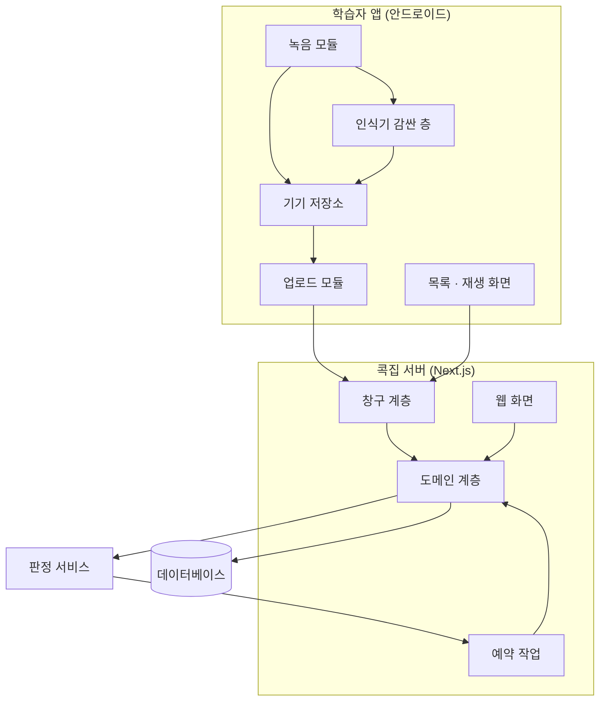
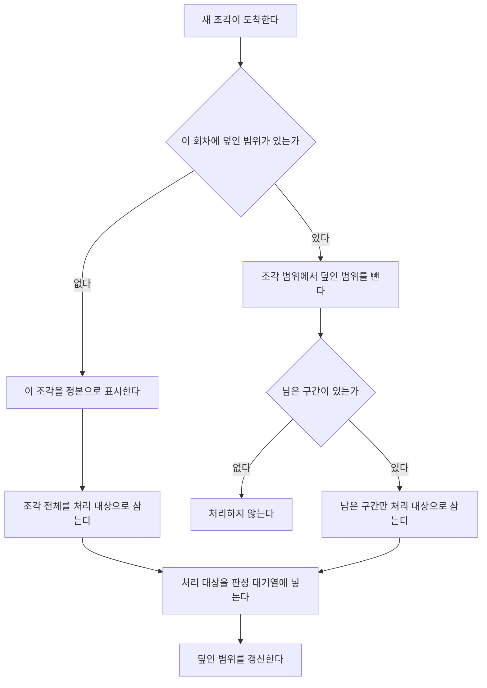
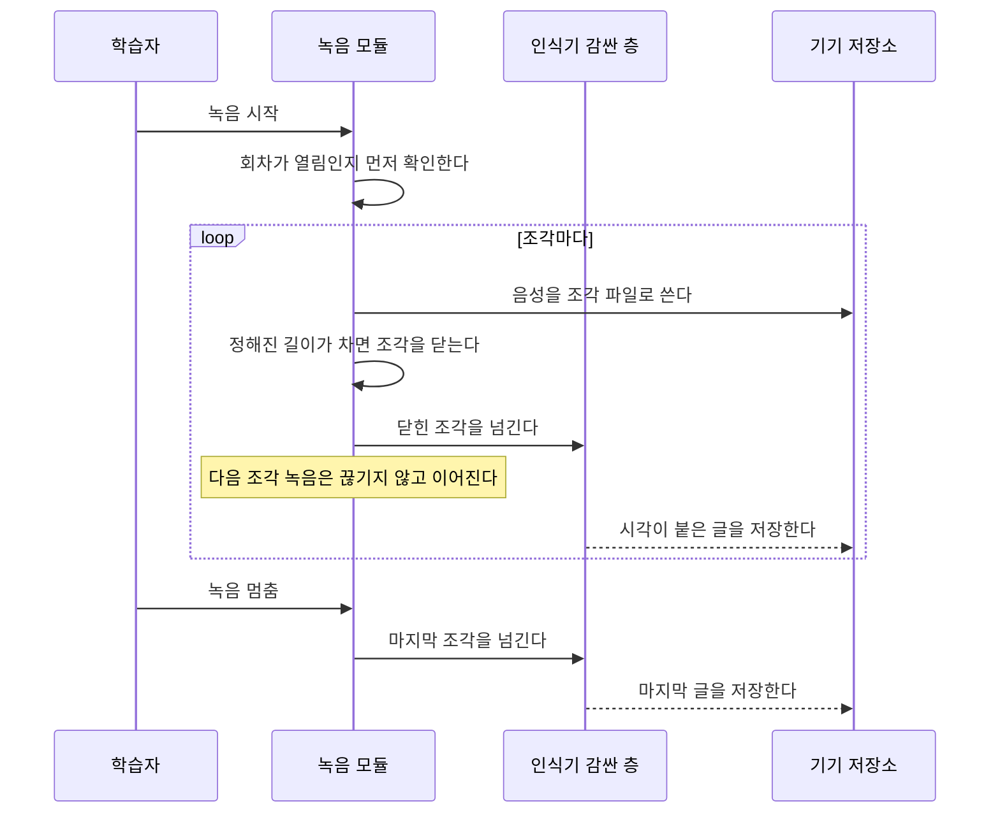
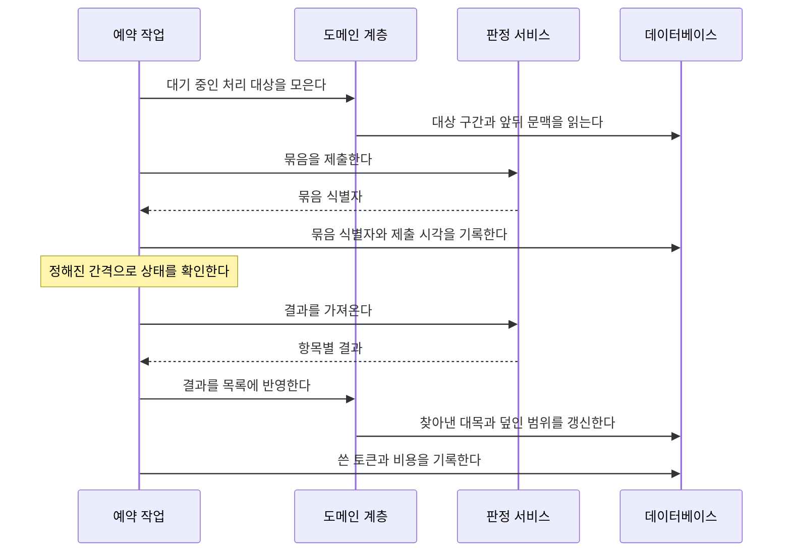

# 콕집 기술 설계 문서

| | |
|---|---|
| 문서 종류 | 기술 설계 문서 |
| 판 | 1.0 |
| 기준 시점 | 2026년 9월 |
| 답하는 질문 | 어떻게 설계하는가 |
| 앞 문서 | 시스템 요구사항 정의서 |

이 문서는 시스템 요구사항 정의서의 요구사항을 어떻게 구현할지를 정한다. 요구사항 번호를 그대로 인용해 어느 설계가 어느 요구사항을 만족하는지 밝힌다.

---

# 1. 설계 원칙

| 원칙 | 내용 |
|---|---|
| 서버는 하나다 | 웹 화면과 앱이 같은 서버를 쓴다. 별도 백엔드를 두지 않는다 |
| 고정비를 두지 않는다 | 판정 외에 분량이나 사용자 수에 비례해 돈이 나가는 부품을 넣지 않는다 |
| 음성은 기기를 떠나지 않는다 | 서버는 글만 받는다. 예외 경로만 음성을 잠시 거치며 처리 후 즉시 지운다 |
| 인식기는 갈아 끼울 수 있다 | 어떤 인식기를 쓸지 아직 정해지지 않았다. 앱 안에서 한 겹으로 감싸 바꿔 끼울 수 있게 만든다 |
| 시각은 실제 시각으로 다룬다 | 저장하는 모든 시각은 실제 시각이다. 경과 시각은 화면에서만 계산한다 |
| 처리는 다시 돌려도 안전하다 | 같은 조각을 두 번 처리해도 결과가 겹쳐 쌓이지 않는다 |
| 웹 단계가 앱 단계의 밑바탕이다 | 1단계에서 만든 창구를 2단계 앱이 그대로 부른다. 웹 전용 창구를 따로 만들지 않는다 |

---

# 2. 전체 구조

## 2-1. 구성 요소



## 2-2. 계층의 역할

| 계층 | 하는 일 | 하지 않는 일 |
|---|---|---|
| 창구 계층 | 앱과 웹의 요청을 받고 입력을 검증한다 | 업무 규칙을 담지 않는다 |
| 도메인 계층 | 정본 선정, 구간 계산, 뒤처짐 판정 같은 규칙을 담는다 | 화면이나 요청 형식을 알지 않는다 |
| 예약 작업 | 판정을 묶어 보내고 결과를 거둔다. 보관 기간이 지난 글을 지운다 | 사용자 요청을 직접 받지 않는다 |
| 인식기 감싼 층 | 어떤 인식기를 쓰든 같은 모양으로 결과를 돌려준다 | 어떤 인식기인지를 바깥에 드러내지 않는다 |

---

# 3. 데이터베이스 설계

## 3-1. 표와 열

| 표 | 주요 열 |
|---|---|
| `Institution` | `id`, `name`, `createdAt` |
| `Course` | `id`, `institutionId`, `name`, `startDate`, `endDate`, `capacity`, `instructorId` |
| `Instructor` | `id`, `name`, `email` |
| `RecordingConsent` | `id`, `instructorId`, `courseId`, `consentedAt`, `tokenHash`, `tokenExpiresAt` |
| `Learner` | `id`, `name`, `email`, `googleSubject`, `joinedAt` |
| `Enrollment` | `id`, `courseId`, `learnerId`, `joinedOn`, `leftOn` |
| `Session` | `id`, `courseId`, `date`, `blockedAt` |
| `RecordingSegment` | `id`, `sessionId`, `learnerId`, `startedAt`, `endedAt`, `gaps`, `clockOffsetMs`, `isCanonical` |
| `Transcript` | `id`, `segmentId`, `blocks`, `createdAt` |
| `CoveredRange` | `id`, `sessionId`, `fromAt`, `toAt` |
| `Highlight` | `id`, `sessionId`, `type`, `quote`, `occurredAt`, `sourceSegmentId` |
| `ListView` | `id`, `learnerId`, `sessionId`, `viewedAt` |
| `AudioIntake` | `id`, `segmentId`, `receivedAt`, `deletedAt` |
| `JudgementBatch` | `id`, `externalId`, `submittedAt`, `completedAt`, `inputTokens`, `outputTokens`, `cost` |

## 3-2. 설계상 중요한 세 가지

**`CoveredRange`가 중복 처리를 막는다.** 한 회차에서 이미 글로 옮기고 판정까지 마친 구간을 실제 시각 범위로 기록한다. 새 조각이 올라오면 그 조각의 범위에서 이미 덮인 범위를 빼고 남은 부분만 처리한다. 이것이 REQ-FUNC-007을 만족하는 장치다.

**`Transcript.blocks`는 시각이 붙은 글 조각의 배열이다.** 각 항목은 시작 실제 시각과 글을 갖는다. 화자 항목은 없다. REQ-DATA-003에 따라 화자 정보를 만들지 않는다.

**`Highlight.occurredAt`은 실제 시각이다.** 어느 조각에서 나왔는지는 `sourceSegmentId`로 남기지만, 화면에서 위치를 계산할 때는 보는 사람의 조각을 기준으로 다시 계산한다.

## 3-3. 정본과 덮인 범위



---

# 4. 창구 설계

## 4-1. 앱이 부르는 창구

| 창구 | 하는 일 | 관련 요구사항 |
|---|---|---|
| 초대 확인 | 초대 링크의 값과 구글 로그인 결과를 받아 명단과 대조하고 계정을 만든다 | REQ-FUNC-003 |
| 오늘 녹음 가능 여부 | 그 학습자의 오늘 회차가 열림인지 알려준다 | REQ-FUNC-002, REQ-FUNC-004 |
| 조각 올리기 | 옮긴 글, 시작과 종료 실제 시각, 중단 구간, 시계 차이를 받는다 | REQ-FUNC-006 |
| 오늘 목록 | 그날의 복습 목록을 돌려준다 | REQ-FUNC-009 |
| 목록 열람 기록 | 목록 화면이 열렸음을 기록한다 | REQ-FUNC-012 |
| 옮긴 글 전체 | 그 회차의 옮긴 글을 돌려준다 | REQ-FUNC-011 |
| 예외 전사 요청 | 기기가 처리하지 못한 조각의 음성을 올린다 | REQ-FUNC-005 |

## 4-2. 웹 화면이 쓰는 것

웹 화면은 창구를 거치지 않고 서버 안에서 도메인 계층을 직접 부른다. 강사 동의 화면, 회차 차단 화면, 훈련기관 화면이 여기에 해당한다.

1단계에서 옮긴 글과 음성 파일을 웹에서 올리는 화면도 같은 도메인 계층을 부른다. 앱이 부르는 조각 올리기 창구와 같은 규칙을 쓴다.

## 4-3. 입력 검증

모든 창구 입력에 같은 검증 규칙을 붙인다. 검증하지 않고 도메인 계층으로 넘어가는 길을 만들지 않는다.

주요 검증 항목은 다음과 같다.

- 시작 실제 시각이 종료 실제 시각보다 앞선다.
- 중단 구간이 조각 범위 안에 있다.
- 시계 차이가 정해진 범위 안에 있다. 범위를 벗어나면 받지 않는다.
- 옮긴 글의 각 항목에 시작 실제 시각이 있다.

---

# 5. 앱 설계

## 5-1. 인식기를 감싸는 층

어떤 인식기를 쓸지 아직 정해지지 않았다. 세 갈래가 열려 있고 확인 뒤에 고른다.

| 갈래 | 내용 |
|---|---|
| 가 | 안드로이드 플랫폼의 기기 내 인식기 |
| 나 | 앱에 넣은 오픈소스 인식 모델 |
| 다 | 서버를 거치는 인식 (예외 경로) |

세 갈래가 **같은 모양의 결과**를 돌려주도록 한 겹으로 감싼다. 감싼 층이 돌려주는 것은 시작 실제 시각이 붙은 글 조각의 배열이며, 그 바깥은 어떤 갈래가 쓰였는지 알지 못한다.

감싼 층이 지켜야 할 것은 REQ-NF-003이다. 기기 안 처리를 강제하는 호출만 쓰고, 그것이 불가능하면 실패로 처리해 예외 경로로 넘긴다. 기기 우선 설정에 기대지 않는다.

## 5-2. 녹음과 전사의 맞물림



**조각 길이는 설정값으로 둔다.** 짧으면 중간에 끊겼을 때 잃는 양이 적고 전사가 빨리 따라붙지만, 조각 경계가 늘어 문맥이 더 자주 끊긴다. 길면 반대가 된다. 초기값은 5분으로 두고 실제 사용에서 조정한다.

## 5-3. 기기 저장소

| 저장하는 것 | 언제 지우는가 |
|---|---|
| 음성 조각 파일 | 학습자가 직접 지울 때. 보관 기간을 앱이 강제하지 않는다 |
| 옮긴 글 | 서버로 올린 뒤 지운다 |
| 올리지 못한 조각의 대기 목록 | 올리기가 끝나면 지운다 |

REQ-NF-005에 따라 회차별 용량을 보여주고 오래된 회차를 지울 수 있게 한다. 녹음을 시작하기 전에 남은 공간을 확인한다.

## 5-4. 올리기

네트워크가 없으면 대기 목록에 넣고 연결되면 보낸다. 같은 조각을 두 번 보내도 서버가 한 번만 받도록 조각마다 앱이 만든 식별자를 함께 보낸다.

---

# 6. 판정 설계

## 6-1. 묶음 처리 흐름



## 6-2. 묶음 주기

REQ-NF-001이 한 시간 상한을 요구한다. 예약 작업이 짧은 간격으로 대기 목록을 확인해 쌓인 것이 있으면 묶어 제출하고, 제출한 묶음의 상태를 확인해 끝난 것을 거둔다.

상한을 지키지 못할 상황이 보이면 그 묶음만 낱개로 돌린다. 값이 두 배가 되지만 요구사항을 어기지 않는다.

## 6-3. 문맥을 함께 넣는 방법

REQ-FUNC-008은 조각 경계에 걸친 발화를 판정할 때 앞 조각의 끝부분과 뒤 조각의 앞부분을 문맥으로 넣도록 요구한다.

처리 대상 구간의 앞뒤로 정해진 길이만큼을 **문맥으로만** 붙여 보낸다. 문맥 구간에서 찾아낸 대목은 결과에서 버린다. 그 구간은 이미 처리됐거나 다음 차례에 처리된다.

## 6-4. 비용 기록

REQ-NF-002가 한 사람 한 달 1,000원 상한을 요구한다. 묶음마다 쓴 토큰과 비용을 기록하고, 과정별로 그달의 비용을 재적 인원으로 나눈 값을 계산한다. 상한을 넘으면 기록을 남긴다.

## 6-5. 다시 돌려도 안전하게

같은 구간이 두 번 처리되면 같은 대목이 두 번 목록에 오른다. 이를 막기 위해 찾아낸 대목마다 회차와 실제 시각과 유형을 합친 값을 유일 조건으로 둔다. 같은 값이 다시 들어오면 새로 만들지 않고 덮어쓴다.

---

# 7. 시각 계산 설계

## 7-1. 세 가지 시각

| 이름 | 뜻 | 어디에 쓰는가 |
|---|---|---|
| 기기 시각 | 학습자 기기의 시계가 가리키는 값 | 녹음 시작과 종료를 잴 때 |
| 실제 시각 | 기기 시각에서 시계 차이를 보정한 값 | 저장하는 모든 시각 |
| 경과 시각 | 특정 녹음의 시작부터 흐른 시간 | 화면에서 재생 위치를 찾을 때 |

## 7-2. 계산 순서

```
실제 시각 = 기기 시각 − 시계 차이
경과 시각 = 실제 시각 − 그 사람 조각의 시작 실제 시각
```

조각을 올릴 때 앱이 시계 차이를 함께 보낸다. 서버는 받은 시각을 실제 시각으로 바꿔 저장한다. 화면에서 재생 위치를 찾을 때는 보는 사람의 조각을 기준으로 경과 시각을 다시 계산한다. REQ-FUNC-010과 REQ-NF-008이 여기에 대응한다.

## 7-3. 담기지 않은 지점의 처리

찾아낸 대목의 실제 시각이 그 학습자의 어느 조각에도 들어 있지 않으면 재생을 열지 않는다. 목록에는 그대로 보이되 그 구간이 자기 녹음에 없다는 사실을 알린다.

---

# 8. 보안과 개인정보 설계

| 대상 | 설계 |
|---|---|
| 강사 전용 주소 | 추측할 수 없는 값을 만들고 그 값의 요약본만 저장한다. 유효 기간이 지나면 열리지 않는다 |
| 학습자 로그인 | 구글이 확인해 준 이메일이 초대 명단에 있을 때만 계정을 만든다. 명단에 없는 이메일은 계정이 만들어지지 않는다 |
| 훈련기관 열람 범위 | 도메인 계층에서 기관 식별자로 걸러낸다. 화면에서 거르지 않는다 |
| 예외 경로 음성 | 들어온 시각을 기록하고 처리 후 즉시 지운다. 예약 작업이 24시간을 넘긴 것을 찾아 지우고 기록을 남긴다 |
| 옮긴 글 보관 | 과정 종료일부터 6개월이 지난 것을 예약 작업이 지운다 |
| 화자 정보 | 만들지 않는다. 저장 구조에 화자 항목 자체가 없다 |
| 판정 서비스 설정 | 학습에 쓰지 않는 설정을 확인하고 그 확인을 기록으로 남긴다 |

---

# 9. 시험 설계

| 대상 | 방법 |
|---|---|
| 도메인 계층 | 단위 시험. 정본 선정, 덮인 범위 차집합, 시각 변환, 뒤처짐 판정이 핵심 대상이다 |
| 창구 계층 | 입력 검증이 잘못된 값을 막는지 확인한다 |
| 웹 화면 | 화면 흐름 시험. 강사 동의부터 회차 차단까지, 올리기부터 목록과 재생까지 |
| 앱 | 기기 시험. 녹음 지속, 조각 나누기, 인식기 감싼 층의 결과 모양 |
| 판정 품질 | REQ-NF-006에 따라 규칙을 고칠 때마다 같은 평가 자료로 두 지표를 함께 잰다 |

**덮인 범위 차집합과 시각 변환은 반드시 단위 시험으로 덮는다.** 이 둘이 틀리면 중복 처리로 비용이 늘거나 재생 위치가 어긋나는데, 화면에서는 늦게 드러난다.

---

# 10. 단계별 구현 범위

## 10-1. 1단계 웹

| 만드는 것 |
|---|
| 데이터베이스 표 전체 |
| 도메인 계층 전체 (정본 선정, 차집합, 시각 변환, 뒤처짐 판정) |
| 예약 작업 (묶음 제출과 수거, 보관 기간 삭제) |
| 강사 동의 화면과 회차 차단 화면 |
| 훈련기관 화면 |
| 옮긴 글과 음성 파일을 올리는 화면 |
| 복습 목록 화면과 지점 재생 |
| 옮긴 글 전체 보기 |

1단계의 재생은 브라우저가 올린 음성 파일을 그 시각부터 재생하는 방식으로 만든다. 시각 계산 규칙은 앱과 같다.

## 10-2. 2단계 앱

| 만드는 것 |
|---|
| 녹음 모듈과 조각 나누기 |
| 인식기 감싼 층 |
| 기기 저장소와 용량 관리 |
| 올리기와 대기 목록 |
| 초대 확인과 본인 확인 |
| 목록과 재생 화면 |
| 알림 |

2단계는 1단계에서 만든 창구를 그대로 부른다. 앱 전용 창구를 새로 만들지 않는다.

---

# 11. 아직 정해지지 않은 것

| 항목 | 언제 정하는가 |
|---|---|
| 어떤 인식기를 쓰는가 | 시험용 앱으로 품질을 잰 뒤 |
| 조각 길이 초기값 | 실제 녹음으로 확인한 뒤 조정 |
| 묶음 확인 간격 | 실제 처리 시간을 잰 뒤 |
| 문맥으로 붙일 길이 | 판정 품질을 재며 조정 |
