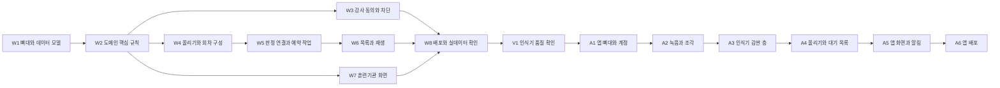

# 콕집 구현 태스크

| | |
|---|---|
| 버전 | 1.0 |
| 기준 시점 | 2026년 9월 |
| 앞 문서 | 기술 설계 문서 |

태스크는 **한 번에 끝까지 붙잡고 갈 수 있는 크기**로 나눴다. 화면 하나나 함수 하나로 쪼개지 않고, 완료했을 때 눈으로 확인할 무언가가 남는 단위로 묶었다.

총 15개다. 웹 8개, 확인 1개, 앱 6개다.

---

# 1. 순서

W3, W4, W7은 W2가 끝나면 서로 상관없이 진행할 수 있다.

---

# 2. 1단계 — 웹

## W1. 프로젝트 뼈대와 데이터 모델

**하는 일** Next.js 프로젝트를 세우고 데이터베이스 표 전체를 만든다.

- 프로젝트 생성, 언어 엄격 설정, 화면 꾸미기 도구 설치
- 데이터베이스 연결 설정. 마이그레이션용 연결과 실행용 연결을 나눈다
- 표 16종의 스키마 작성과 첫 마이그레이션
- 검증 규칙을 모아 둘 자리와 계층 폴더 구조

**만족하는 요구사항** 없음 (밑바탕)

**완료 기준**
- 마이그레이션이 실제 데이터베이스에 적용된다.
- 표 16종이 기술 설계 문서 3-1과 일치한다.
- 빈 화면이 뜨고 데이터베이스에 연결된다.

## W2. 도메인 핵심 규칙

**하는 일** 이 제품에서 틀리면 가장 비싼 네 가지 규칙을 만들고 단위 시험으로 덮는다.

- 정본 선정
- 덮인 범위 차집합
- 실제 시각과 경과 시각 변환
- 뒤처짐 판정

**만족하는 요구사항** REQ-FUNC-007, REQ-FUNC-013, REQ-NF-008

**완료 기준**
- 네 규칙이 화면이나 요청 형식을 알지 않는 함수로 존재한다.
- 단위 시험이 다음 경우를 덮는다. 조각이 겹칠 때, 조각이 떨어져 있을 때, 조각이 정본을 완전히 포함할 때, 시계가 앞서거나 뒤처질 때, 강의가 없는 날이 사이에 낀 연속 일수.
- 같은 구간을 두 번 넣어도 처리 대상이 늘지 않는다.

## W3. 강사 동의와 회차 차단

**하는 일** 강사가 계정 없이 전용 주소로 동의하고 회차를 닫는 흐름을 만든다.

- 전용 주소 발급과 요약본 저장, 유효 기간 처리
- 동의 화면. 녹음 허용 범위, 전사 대상, 보관 기간 6개월, 회차 차단 권한을 보여준다
- 회차 목록과 차단 및 해제 화면
- 미동의 강사에게 다시 안내하는 예약 작업

**만족하는 요구사항** REQ-FUNC-001, REQ-FUNC-002

**완료 기준**
- 강사 이메일을 넣으면 안내가 발송된다.
- 유효 기간이 지난 주소로는 동의 화면이 열리지 않는다.
- 닫힌 회차는 오늘 녹음 가능 여부를 묻는 창구가 닫힘으로 답한다.
- 새로 만들어지는 회차의 기본 상태가 열림이다.

## W4. 올리기와 회차 구성

**하는 일** 옮긴 글과 음성 파일을 받아 회차를 만들고 처리 대상을 산출한다.

- 올리기 화면. 옮긴 글 파일, 음성 파일, 시작과 종료 실제 시각을 받는다
- 조각 올리기 창구와 입력 검증
- 날짜로 회차를 만들거나 기존 회차에 묶는 처리
- W2의 규칙을 불러 처리 대상을 산출하고 대기열에 넣는다
- 같은 조각을 두 번 보내도 한 번만 받는 처리

**만족하는 요구사항** REQ-FUNC-005, REQ-FUNC-006

**완료 기준**
- 회차를 미리 등록하지 않아도 날짜로 회차가 만들어진다.
- 같은 날짜의 여러 조각이 한 회차에 묶인다.
- 두 번째 조각을 올리면 덮이지 않은 구간만 대기열에 들어간다.
- 잘못된 시각 관계나 범위를 벗어난 시계 차이는 받지 않는다.
- 올리는 화면에 질의응답이 함께 전사된다는 안내가 보인다.

## W5. 판정 연결과 예약 작업

**하는 일** 대기열을 묶어 판정을 보내고 결과를 거둬 목록에 반영한다. 정리 작업도 함께 만든다.

- 판정 요청 만들기. 대상 구간과 앞뒤 문맥을 붙이고 문맥에서 나온 결과는 버린다
- 묶음 제출과 상태 확인과 결과 수거
- 결과를 찾아낸 대목으로 저장하고 덮인 범위를 갱신한다
- 같은 대목이 두 번 들어와도 겹쳐 쌓이지 않게 한다
- 쓴 토큰과 비용 기록, 한 사람당 값 계산
- 보관 기간이 지난 옮긴 글 삭제, 24시간을 넘긴 음성 삭제

**만족하는 요구사항** REQ-FUNC-008, REQ-NF-001, REQ-NF-002, REQ-DATA-001, REQ-DATA-002, REQ-DATA-005

**완료 기준**
- 실제 전사 원문을 넣어 찾아낸 대목이 나온다.
- 같은 조각을 두 번 처리해도 목록에 같은 대목이 두 번 오르지 않는다.
- 묶음으로 보낸 것과 낱개로 보낸 것의 비용 차이가 기록에 남는다.
- 한 사람당 월 비용이 계산되고 상한을 넘으면 기록이 남는다.
- 보관 기간이 지난 옮긴 글이 삭제된다.

## W6. 목록과 재생

**하는 일** 학습자가 보는 화면 전부를 만든다.

- 복습 목록 화면. 유형, 강도, 강사의 말, 시각이 보인다
- 하루에 하나의 목록에 조각 결과가 강도 높은 순으로 더해진다
- 지점 재생. 올린 음성 파일을 그 지점부터 재생한다
- 담기지 않은 지점의 처리
- 옮긴 글 전체 보기. 화자 표시 없이 시각 순으로 보인다
- 열람 기록

**만족하는 요구사항** REQ-FUNC-009, REQ-FUNC-010, REQ-FUNC-011, REQ-FUNC-012, REQ-DATA-003

**완료 기준**
- 목록이 회차가 아니라 날짜 단위로 하나 나온다.
- 한 줄을 누르면 음성이 그 지점부터 재생된다.
- 시작 시각이 다른 두 음성 파일을 각각 올렸을 때 같은 대목이 각자의 위치에서 재생된다.
- 지점이 음성 범위 밖이면 재생이 열리지 않고 그 사실이 보인다.
- 목록 화면을 열면 열람 기록이 남는다.

## W7. 훈련기관 화면과 로그인

**하는 일** 훈련기관 담당자가 보는 화면을 만든다.

- 이메일과 비밀번호 로그인, 비밀번호 되찾기
- 뒤처지는 수강생 목록. 며칠째 열지 않았는지를 숫자로 보여준다
- 기관 식별자로 거르는 처리를 도메인 계층에 둔다

**만족하는 요구사항** REQ-FUNC-013, REQ-FUNC-014, REQ-DATA-004

**완료 기준**
- 다른 기관의 과정이 조회되지 않는다. 화면이 아니라 도메인 계층에서 막힌다.
- 강의가 없는 날이 사이에 끼어도 연속 일수가 잘못 올라가지 않는다.
- 이 화면에서 옮긴 글이나 복습 목록 내용에 접근할 수 없다.

## W8. 배포와 실데이터 확인

**하는 일** 웹을 실제로 올리고 실제 강의 전사본으로 끝까지 돌려 본다.

- 배포 설정과 운영 데이터베이스 연결
- 환경별 설정값 분리
- 실제 강의 전사본과 음성으로 올리기부터 목록과 재생까지 확인
- 화면 흐름 시험 작성

**만족하는 요구사항** 1단계 전체

**완료 기준**
- 주소 하나로 접속해 강사 동의부터 복습 목록 재생까지 이어진다.
- 실제 강의 전사본으로 찾아낸 대목이 나오고 그 지점이 재생된다.
- 화면 흐름 시험이 두 경로를 덮는다. 강사 동의부터 차단까지, 올리기부터 재생까지.

---

# 3. 확인

## V1. 인식기 품질 확인

**하는 일** 우리 앱이 쓸 인식기가 어느 정도 품질을 내는지 잰다. 앱 본격 착수 전에 갈래를 정한다.

- 버튼 하나짜리 시험용 앱. 기기 안 처리를 강제하는 호출로 녹음 파일을 전사한다
- 같은 강의를 기존 전사본과 나란히 놓고 판정을 각각 돌린다
- 찾아낸 대목의 겹침을 센다
- 인용문 30~50건을 사람이 읽고 알아볼 수 있는지 센다
- 세 시간과 여섯 시간 녹음이 끝까지 처리되는지 확인한다
- 녹음과 전사를 켠 채 시간당 배터리 소모를 잰다

**만족하는 요구사항** REQ-NF-003, REQ-NF-004, REQ-NF-007의 전제

**완료 기준**
- 찾아낸 대목의 겹침 비율이 숫자로 나온다.
- 세 갈래 중 무엇으로 갈지가 그 숫자를 근거로 정해진다.
- 결정과 근거가 착수 전 결정 문서에 기록된다.

---

# 4. 2단계 — 앱

## A1. 앱 뼈대와 계정

**하는 일** 안드로이드 앱을 세우고 학습자가 들어오는 길을 만든다.

- 프로젝트 생성과 화면 뼈대
- 초대 링크로 앱을 여는 처리
- 구글 계정 로그인 연결
- 로그인한 이메일을 초대 명단과 대조하는 처리
- 앱을 다시 깔았을 때 계정을 되찾는 처리

**만족하는 요구사항** REQ-FUNC-003

**완료 기준**
- 명단에 없는 이메일로는 계정이 만들어지지 않는다.
- 확인이 끝나면 그 학습자가 과정에 속한 것으로 기록된다.
- 앱을 지우고 다시 깔아 같은 구글 계정으로 계정을 되찾는다.

## A2. 녹음과 조각

**하는 일** 녹음 모듈과 기기 저장소를 만든다.

- 녹음 시작 전 회차 열림 확인
- 화면이 꺼져 있거나 다른 앱을 쓰는 동안에도 이어지는 녹음
- 정해진 길이로 조각을 닫고 다음 조각을 이어가는 처리
- 시작과 종료 실제 시각, 중단 구간, 시계 차이 기록
- 회차별 용량 표시와 오래된 회차 삭제
- 녹음 시작 전 남은 공간 확인
- 눈에 띄는 멈춤 버튼

**만족하는 요구사항** REQ-FUNC-004의 녹음 부분, REQ-NF-004, REQ-NF-005

**완료 기준**
- 여섯 시간 연속 녹음이 완료된다.
- 앱을 강제로 끝내도 마지막으로 닫힌 조각까지 남는다.
- 닫힌 회차에서는 녹음 버튼이 열리지 않는다.
- 공간이 부족하면 녹음이 시작되지 않고 알린다.

## A3. 인식기 감싼 층

**하는 일** V1에서 고른 갈래로 전사를 붙이되, 갈아 끼울 수 있는 한 겹으로 감싼다.

- 감싼 층의 결과 모양을 정한다. 시작 실제 시각이 붙은 글 조각의 배열
- 기기 안 처리를 강제하는 호출. 불가능하면 실패로 처리
- 닫힌 조각을 넘겨 전사하고 다음 조각 녹음과 겹쳐 돌린다
- 실패한 조각을 예외 경로로 넘기는 처리

**만족하는 요구사항** REQ-FUNC-004의 전사 부분, REQ-FUNC-005, REQ-NF-003

**완료 기준**
- 비행기 모드에서 전사가 동작한다.
- 앞 조각의 전사가 뒤 조각의 녹음과 겹쳐 진행된다.
- 녹음을 멈춘 뒤 마지막 조각의 길이를 넘는 대기가 생기지 않는다.
- 감싼 층을 다른 갈래로 바꿔도 바깥 코드가 바뀌지 않는다.

## A4. 올리기와 대기 목록

**하는 일** 조각을 서버로 보내는 길을 만든다.

- 옮긴 글, 시각, 중단 구간, 시계 차이를 함께 보낸다
- 네트워크가 없으면 대기 목록에 넣고 연결되면 보낸다
- 같은 조각을 두 번 보내도 서버가 한 번만 받게 하는 식별자
- 올린 뒤 기기의 옮긴 글을 지운다

**만족하는 요구사항** REQ-FUNC-006

**완료 기준**
- 비행기 모드에서 녹음한 조각이 연결 후 자동으로 올라간다.
- 같은 조각을 두 번 보내도 서버 기록이 하나다.
- 웹에서 올린 것과 앱에서 올린 것이 같은 창구를 쓴다.

## A5. 앱 화면과 알림

**하는 일** 학습자가 앱에서 보는 화면을 만든다.

- 복습 목록 화면
- 지점 재생. 기기 저장소의 음성 파일을 경과 시각으로 연다
- 담기지 않은 지점과 원본이 없는 경우의 처리
- 옮긴 글 전체 보기
- 열람 기록
- 목록 준비 알림과 끄기

**만족하는 요구사항** REQ-FUNC-009, REQ-FUNC-010, REQ-FUNC-011, REQ-FUNC-012, REQ-FUNC-015

**완료 기준**
- 목록의 한 줄을 누르면 기기의 음성이 그 지점부터 재생된다.
- 늦게 녹음을 시작한 학습자도 자기 녹음 안에 있는 지점은 재생된다.
- 원본을 지운 회차는 재생이 열리지 않고 목록과 옮긴 글은 그대로 보인다.
- 목록이 갱신되면 알림이 오고 학습자가 끌 수 있다.

## A6. 앱 배포

**하는 일** 앱을 실제로 내보낸다.

- 서명과 배포 설정
- 앱 장터 등록과 심사 대응
- 기기 시험 작성

**만족하는 요구사항** 2단계 전체

**완료 기준**
- 실제 기기에 설치해 녹음부터 재생까지 이어진다.
- 기기 시험이 녹음 지속, 조각 나누기, 감싼 층의 결과 모양을 덮는다.

---

# 5. 요구사항과 태스크 대조

| 요구사항 | 태스크 |
|---|---|
| REQ-FUNC-001 | W3 |
| REQ-FUNC-002 | W3 |
| REQ-FUNC-003 | A1 |
| REQ-FUNC-004 | A2, A3 |
| REQ-FUNC-005 | W4, A3 |
| REQ-FUNC-006 | W4, A4 |
| REQ-FUNC-007 | W2, W4 |
| REQ-FUNC-008 | W5 |
| REQ-FUNC-009 | W6, A5 |
| REQ-FUNC-010 | W6, A5 |
| REQ-FUNC-011 | W6, A5 |
| REQ-FUNC-012 | W6, A5 |
| REQ-FUNC-013 | W2, W7 |
| REQ-FUNC-014 | W7 |
| REQ-FUNC-015 | A5 |
| REQ-NF-001 | W5 |
| REQ-NF-002 | W5 |
| REQ-NF-003 | V1, A3 |
| REQ-NF-004 | V1, A2 |
| REQ-NF-005 | A2 |
| REQ-NF-006 | W5 |
| REQ-NF-007 | V1 |
| REQ-NF-008 | W2 |
| REQ-DATA-001 | W5 |
| REQ-DATA-002 | W5 |
| REQ-DATA-003 | W6 |
| REQ-DATA-004 | W7 |
| REQ-DATA-005 | W5 |
| REQ-DATA-006 | W5 |

요구사항 29건이 모두 어느 태스크엔가 붙어 있다.
